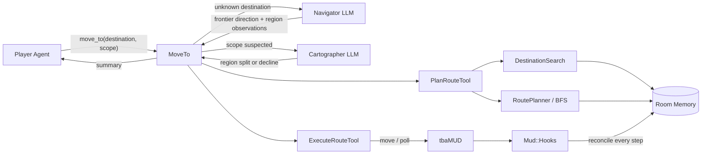
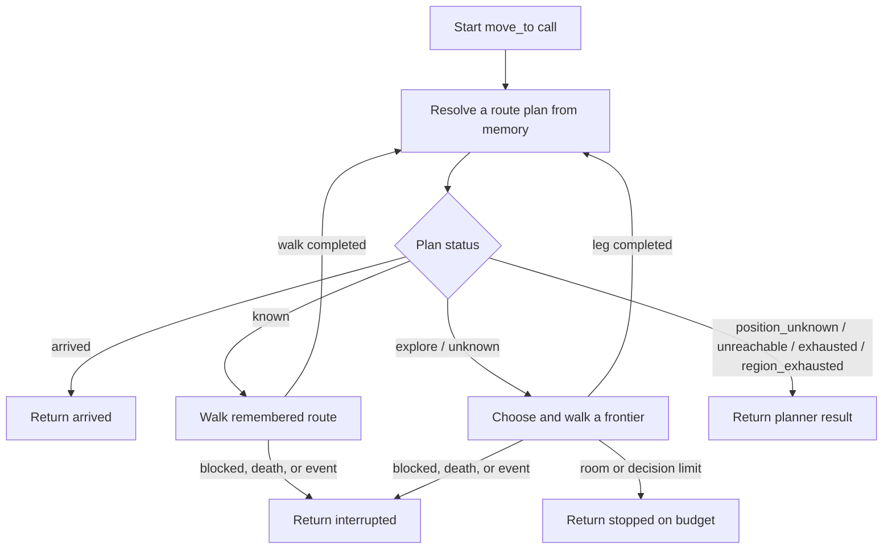
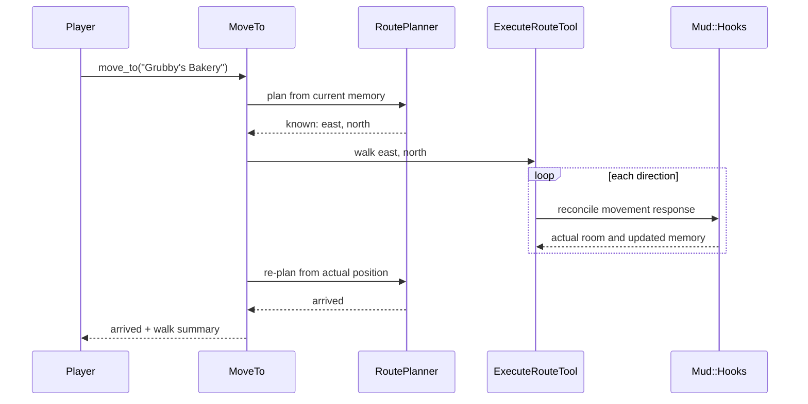
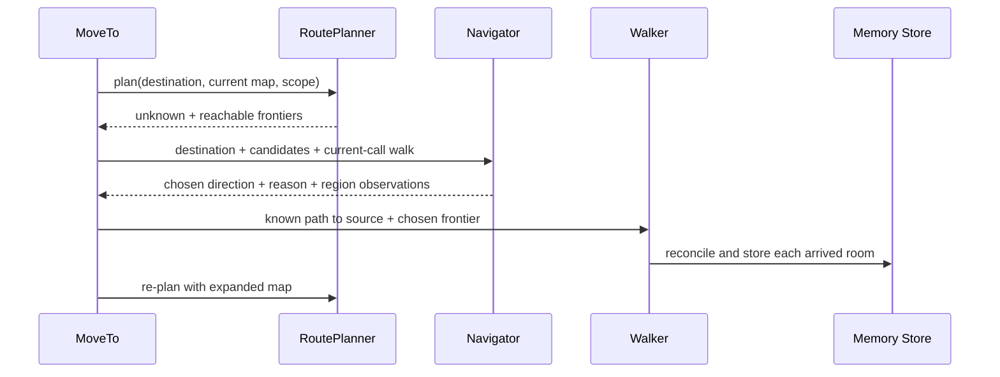
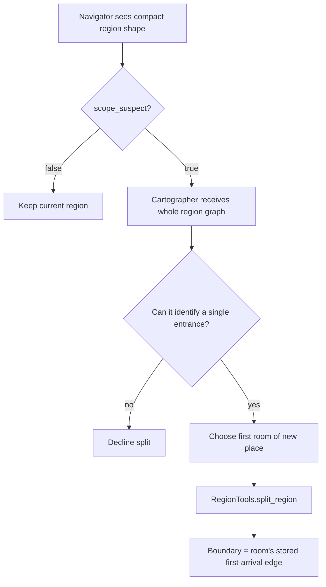
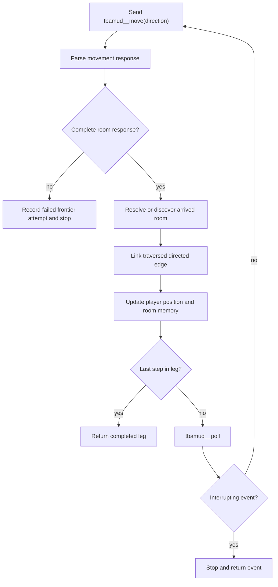
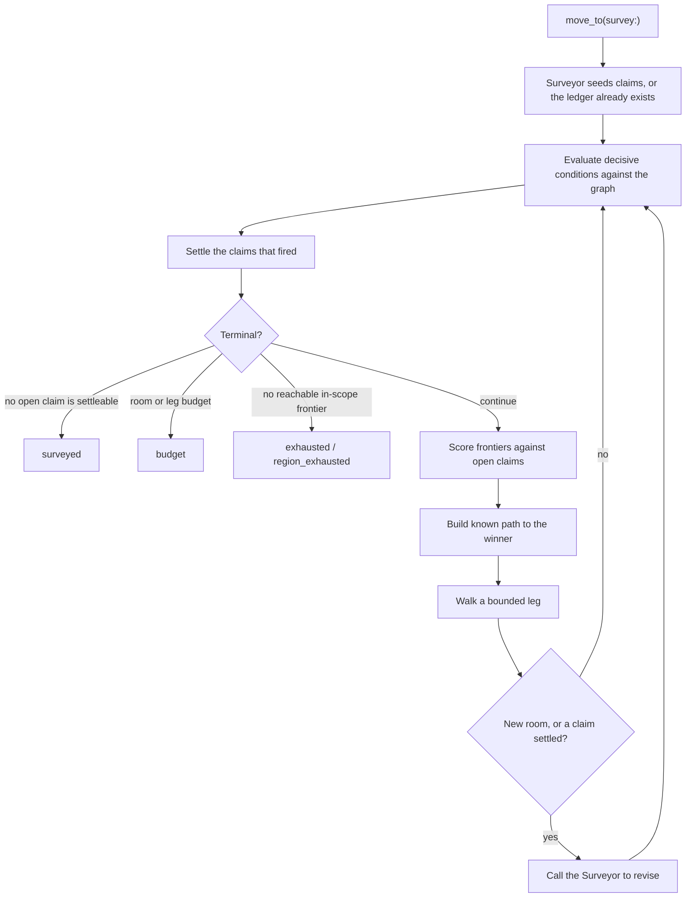

# How `move_to` Works

This document explains the `move_to` system as it exists today. Its purpose is
to make the code understandable enough to change deliberately, without having to
reconstruct the architecture from implementation comments and planning notes.

The most important fact is:

> `move_to` is a bounded loop over the agent's remembered room graph, in one of
> two objective modes.

**Destination mode** (`move_to(destination:)`) seeks a named place and stops
when a room matches it. **Survey mode** (`move_to(survey:)`) investigates the
place the agent is standing in and stops when a ledger of falsifiable claims has
no settleable open claim left. The two share the whole walking engine — the same
breadth-first search, the same bounded legs, the same per-step reconciliation
and interruption polling — and differ only in the objective and the termination
test.

Survey mode is described in section 18. Everything before it describes
destination mode, which is unchanged.

## 1. Why `move_to` exists

Originally, the player could choose among three movement mechanisms:

- `tbamud__move` for one direction;
- `plan_route` to find a path or list unexplored exits;
- `execute_route` to walk a known path.

This made the desired sequence optional. Even when the player initially planned
a route, it could return to issuing one `move` per model iteration. That was both
expensive and unreliable.

`move_to` removes that choice from the player's tool surface:

```text
move_to(destination: "the bakery", scope: "region")
```

The player states where it wants to go. The subsystem decides whether to:

- return immediately because the player is already there;
- walk a remembered route without an LLM decision;
- ask the Navigator to choose among unexplored exits;
- stop because it is blocked, interrupted, out of budget, or out of frontiers.

`plan_route`, `execute_route`, and `tbamud__move` still exist internally. They
are composed behind `move_to` rather than exposed as competing movement choices.

## 2. Architecture at a glance



The components have deliberately different responsibilities:

| Component | Responsibility | Uses an LLM? |
|---|---|---:|
| Player Agent | Names the destination and chooses regional or world scope | Yes |
| `MoveTo` | Owns the loop, budgets, branch selection, walking, and final report | No |
| `PlanRouteTool` | Builds a route plan from memory | No |
| `DestinationSearch` | Finds remembered rooms matching the destination text | No |
| `RoutePlanner` | Runs BFS and ranks reachable frontiers | No |
| Navigator | Chooses one frontier using destination and exit-name meaning | Yes |
| Cartographer | Places or declines a region boundary after suspicion is raised | Yes |
| `ExecuteRouteTool` | Walks a sequence of directions and polls for interruptions | No |
| `Mud::Hooks` | Identifies each arrived room and updates memory immediately | No |
| `RegionTools` | Applies region names and exact first-arrival boundaries | No |

Survey mode adds three more, all covered in section 15:

| Component | Responsibility | Uses an LLM? |
|---|---|---:|
| `Survey` | Owns the survey loop, its budgets, and its terminal status | No |
| `ClaimPlanner` | Evaluates decisive conditions and scores frontiers against open claims | No |
| Surveyor | Opens, revises, parks and retires claims — and never picks a frontier | Yes |

## 3. The public contract

The player sees one movement tool, taking one of two objectives:

```ruby
move_to(destination:, scope: "region")   # travel
move_to(survey:,      scope: "region")   # investigate
```

All three parameters are optional in the advertised schema, which is what lets
the two modes be alternatives rather than both being demanded on every call. A
call giving neither objective is refused.

Survey mode is a parameter rather than a second tool deliberately. A separate
`survey_region` tool would recreate the fork this design exists to remove: with
two movement tools on the surface the agent drifts back to treating `move_to` as
raw movement, exactly as it drifted back to `move` when `plan_route` and
`execute_route` sat beside it.

### `destination`

Free text naming a place, landmark, entity, or thing:

```text
"the bakery"
"Temple Square"
"the mayor"
```

The destination is always interpreted as something to find and eventually
arrive at. Today the implementation does not reject bare directions such as
`"south"`, even though a direction is not a destination.

### `scope`

`scope` controls only where the subsystem may explore for an unknown
destination:

- `"region"` searches unexplored exits belonging to the current region and its
  child regions;
- `"world"` allows unexplored exits anywhere reachable on the remembered map.

Scope does **not** constrain travel to a known destination. If the bakery is
already mapped, `move_to` may cross region boundaries to reach it regardless of
the scope argument.

Widening from region to world is intentionally a player decision. When every
reachable frontier is outside the current region, `move_to` returns
`region_exhausted` and suggests the corresponding `scope: "world"` call. It
does not widen silently.

## 4. The central loop

Every `move_to` call creates fresh call-local state:

- destination query;
- scope;
- completed legs;
- rooms walked;
- Navigator decisions used;
- terminal status and explanation.

It then repeatedly plans from the player's current remembered position.



Replanning is the heart of the design. A decision is never assumed to remain
correct indefinitely:

1. Plan using current memory.
2. Walk a bounded leg.
3. Reconcile every arrived room into memory.
4. Plan again from the actual new position.

This is how an initially unknown destination can become known midway through
one call.

## 5. How planning works

Planning is read-only. It performs no MUD commands and does not issue a hidden
`look`.

### 5.1 Destination matching

`DestinationSearch` searches only the agent's memory:

- room names;
- remembered entities;
- room descriptions and locally generated look candidates;
- remembered exit target names.

Matches are ranked in tiers, strongest first:

1. exact room name;
2. phrase in a room name;
3. room-name token overlap;
4. remembered entity;
5. description or look-candidate evidence;
6. exit target name.

Only tiers 1–4 decisively identify a destination room. Description and exit-name
matches are clues for exploration, not proof that the matching room is the
destination.

### 5.2 The remembered graph

Rooms are vertices. A linked exit is a directed edge:

```text
room #7 --south--> room #8
```

An exit whose destination has not been visited is a frontier:

```text
room #7 --east--> "Main Street" --?--> unknown room
```

`RoutePlanner` runs breadth-first search over linked directed edges. From that
it obtains:

- every reachable remembered room;
- the shortest known path to each room;
- the distance and path to each reachable frontier's source room.

### 5.3 Plan statuses

```mermaid
stateDiagram-v2
    [*] --> position_unknown: no current room
    [*] --> arrived: decisive match is current room
    [*] --> known: decisive match is reachable
    [*] --> unreachable: decisive match exists but no linked path reaches it
    [*] --> explore: no decisive room; a frontier has destination evidence
    [*] --> unknown: no decisive room and no frontier has destination evidence
    [*] --> region_exhausted: frontiers exist, but all are outside regional scope
    [*] --> exhausted: no reachable frontier exists
```



The `known` and `arrived` statuses depend on lexical destination matching.
`explore` and `unknown` depend on reachable frontiers.

### 5.4 Frontier ranking

The deterministic planner ranks frontiers lexicographically by:

1. whether the frontier target name directly clues the destination;
2. how strongly the frontier's source room matches the query;
3. how many region changes the known path crosses;
4. BFS distance to the frontier's source room;
5. previous failed attempts on that frontier;
6. canonical direction order;
7. source room ID.

This ranking provides a safe fallback and controls display order. It does not
claim to understand what room names mean. That semantic choice is why the
Navigator exists.

## 6. Known destination: no reasoning call

Suppose memory contains:

```text
Temple Square --east--> Market Street --north--> Grubby's Bakery
```

A call to:

```text
move_to(destination: "Grubby's Bakery", scope: "region")
```

produces a `known` plan with `east → north`. `MoveTo` passes those directions
straight to the walker. The Navigator and Cartographer are not needed.



Known routes are therefore cheap at the model layer: the player makes the
`move_to` call, but the path itself requires no per-room LLM decision.

## 7. Unknown destination: Navigator-assisted exploration

When no remembered room decisively matches the destination, the planner returns
reachable frontiers. Each candidate includes:

- the direction of the unexplored exit;
- the target name printed by the MUD, if known;
- the source room;
- distance from the current room;
- the remembered walk to that source room.

For example:

```json
{
  "destination": "the bakery",
  "here": "The Temple Of Midgaard (#1)",
  "candidates": [
    {
      "direction": "north",
      "leads_to": "By The Temple Altar",
      "from": "The Temple Of Midgaard",
      "moves_away": 0,
      "walk": []
    },
    {
      "direction": "south",
      "leads_to": "The Temple Square",
      "from": "The Temple Of Midgaard",
      "moves_away": 0,
      "walk": []
    }
  ],
  "walked_so_far": []
}
```

The Navigator returns exactly one small JSON decision:

```json
{
  "direction": "south",
  "reason": "A square is a stronger route toward city shops than a temple altar.",
  "place": null,
  "scope_suspect": false,
  "scope_reason": null
}
```

`MoveTo` validates the answer against the candidate list. If multiple
candidates use the same direction from different source rooms, the nearer one
wins. If the Navigator names no valid direction, the subsystem uses the
planner's top-ranked frontier and records that fallback.

The selected leg consists of:

```text
known walk to frontier source + unexplored direction
```

It is truncated by both `max_steps_per_leg` and the remaining room budget.
After the leg, planning starts again.



### What the Navigator remembers

Each Navigator decision runs in a fresh small context. It receives
`walked_so_far`, but that field contains only rooms walked earlier in the
current `move_to` call.

It does not receive:

- chronological movement from previous `move_to` calls;
- previously chosen frontiers across the session;
- branch coverage metrics;
- a persistent exploration mission;
- player conversation history;
- preferences such as "stay outdoors" or "spread across several streets,"
  unless they happen to be encoded in the destination or added to its payload.

This limitation matters for broad surveying. The Navigator can choose a
promising frontier toward a bakery, but it cannot currently maintain a
long-running strategy for mapping a city.

## 8. Regions and scope

Regions are remembered groupings of rooms. They influence unknown-destination
exploration, not known-route travel.

Newly derived regions can begin with a provisional label such as:

```text
⟨from The Temple Of Midgaard⟩ — unconfirmed
```

The Navigator has two secondary responsibilities related to regions.

### 8.1 Naming an unconfirmed region

The Navigator may return a `place` value when it can identify the larger place
the player is standing in. `MoveTo` applies that value through
`RegionTools.name_region` before walking the next leg.

This renames the existing region; it does not create a boundary.

The write occurs only when:

- `tools.navigation.act_on_place` is enabled;
- a current region exists;
- the region is not already confirmed;
- the answer is not null or one of the "unchanged" values.

### 8.2 Detecting that a region has become too broad

Once the current region contains at least `min_rooms_for_scope_check` rooms, the
Navigator also receives a region-shape question. The region shape contains:

- room count;
- reachable unexplored exit count;
- nearest frontier distance;
- median frontier distance.

The Navigator may answer `scope_suspect: true` when those facts suggest that
one region label has grown to cover distinct places.

This is only a suspicion. The Navigator does not choose the boundary.

## 9. What the Cartographer actually does

The Cartographer is not an exploration strategist and does not select
frontiers. It answers one narrow question:

> If the current region should be split, at which remembered room did the new
> place begin?

It runs only when all of the following are true:

- a Cartographer task is configured;
- a current region exists;
- the minimum-room gate is open;
- the Navigator returned `scope_suspect: true`.



The Cartographer receives:

- current room;
- the Navigator's reason for suspicion;
- every room in the region;
- each room's first-arrival source and direction;
- distance of each room from the current position;
- unexplored exits attached to each room;
- all known linked edges inside the region.

It may either:

```json
{
  "split_at_room_id": 12,
  "label": "The Mayor's Residence",
  "within": "Midgaard",
  "reason": "The interior rooms hang from one entrance at room 12."
}
```

or decline:

```json
{
  "split": false,
  "reason": "The region is large but remains one interconnected street network."
}
```

The chosen room must belong to the region. `RegionTools.split_region` places
the boundary on the edge by which that room was first discovered:

```text
first_entered_from --first_entered_by--> split_at_room
```

That first-arrival edge is stored at room discovery time. It lets the
Cartographer place a boundary several legs after it was crossed without guessing
which edge introduced the room.

The Cartographer sees the accumulated graph, but not a chronological traversal
history. Its graph input is designed for boundary placement, not for judging
whether previous exploration was broad or repetitive.

## 10. Walking and immediate reconciliation

`ExecuteRouteTool.walk` executes one direction at a time through the navigation
permission slice.



After every successful move, `Mud::Hooks#reconcile_move!`:

1. parses the room response;
2. resolves whether this is a known, new, or ambiguous room;
3. records new rooms, exits, and surveyed entities;
4. links the traversed exit from the previous room to the arrived room;
5. updates the stored player position;
6. records the frontier attempt as successful.

If movement does not produce a complete room response, the attempt is recorded
as failed and the leg stops.

Between steps, the walker polls for interrupting events. Combat, death, or
another classified interruption stops the route and returns control to the
player instead of blindly completing the remaining directions.

### Directed-edge consequence, and presumed edges

The traversed edge is linked only in the direction walked. Walking:

```text
A --south--> B
```

does not create:

```text
B --north--> A
```

unless that reverse direction is separately traversed and reconciled.

This is deliberate rather than a defect. `docs/plans/week_2/plan_route.md`
states the rule directly—"Do not infer a reverse edge"—on the grounds that MUD
exits may be one-way, gated, or non-Euclidean, so a manufactured return edge
would produce routes the agent cannot walk. The decision is enforced by
`test_one_way_exits_are_not_reversed` and by the store invariant that
`link_exit!` is the only writer of `target_room_id`.

What was genuinely defective was adjacent to it, and is now fixed. The MUD's
`exits` output names the room behind each exit and `room_parser.rb` has always
parsed those names into `room_exits.target_name`, but nothing compared them
against rooms already in memory, so an exit leading to a thoroughly mapped room
was stored and planned exactly like an exit leading somewhere unknown.

Exit name resolution matches those names against known rooms and records a
**presumed** link in `room_exits.presumed_target_id`—a separate column from
`target_room_id`, so a name match never becomes indistinguishable from a walked
traversal. Three guards decide when a name is an identifier:

1. the normalised name must match exactly one room in memory;
2. no two exits from the same source room may share a target name, which is what
   stops the two ends of Main Street from being fused into one vertex;
3. a name that has ever identified two rooms is recorded in
   `exit_name_ambiguity` and never resolved again.

Presumed edges are traversable by BFS but ranked strictly after earned ones, so
a route made entirely of walked steps always beats a shorter one resting on a
name, and a plan that depends on a presumption says so. An exit holding a
presumed target is no longer counted as a frontier. The state block renders it
`~`, distinct from `✓` (walked) and `?` (unknown).

Walking a presumed edge settles it: arriving where the name said promotes it
through `link_exit!`, and arriving anywhere else clears the presumption and
poisons the name, so a wrong guess costs one move once rather than every future
route that needed the edge.

This is not reverse inference. Nothing asserts symmetry, an exit the MUD did not
print is never created, and it recovers structure symmetry assumptions cannot—
room 1 has both a `south` and a `down` exit to The Temple Square, and only
`south` was ever walked. On the recorded Midgaard map it turns four of fifteen
unlinked exits into edges, drops the frontier set from fifteen to eleven, and
takes the set of rooms reachable from The Dump from **zero to eight**. The fifth
candidate row, room 1's `down`, is correctly refused by guard two. See
`docs/plans/week_3/exit_name_resolution.md`.

## 11. Budgets and stopping conditions

One `move_to` call is intentionally bounded:

| Setting | Default | What it bounds |
|---|---:|---|
| `max_rooms` | 12 | Total successfully walked rooms |
| `max_decisions` | 6 | Navigator calls |
| `max_steps_per_leg` | 4 | Distance walked before replanning |
| `min_rooms_for_scope_check` | 3 | When region-scope suspicion may be requested |

Survey mode has its own, because a survey walks further than a trip to the
bakery and borrowing the travel ceilings would make it useless:

| Setting | Default | What it bounds |
|---|---:|---|
| `survey_max_rooms` | 30 | Total successfully walked rooms in one survey |
| `survey_max_legs` | 14 | Legs before the survey reports on budget |
| `survey_max_reasoner_calls` | 8 | Surveyor calls |
| `max_open_claims` | 6 | Claims open at once; the rest are parked |
| `survey_saturation_rooms` | 6 | Rooms without a new class before `composition` saturates |

These bound resources. They do not describe intent, which is the difference
between them and the `min_rooms` floor an earlier design used to judge
completion by — completion is now the condition that no open claim has a
decisive test left within budget, and that is computed.

`max_rooms` and `max_decisions` protect different resources. A long known
corridor may consume many rooms with no Navigator calls. A dense unknown area
may consume several Navigator calls while moving only a few rooms.

`max_steps_per_leg` is the compromise between two failures:

- too high: one stale semantic decision can carry the player far away;
- too low: the design regresses to one LLM decision per room.

After every completed leg, `MoveTo` replans before checking the next branch's
budget. Therefore, if the final permitted step reaches the destination, the
result is honestly `arrived` rather than `stopped on budget`.

The call can end with:

- `arrived`;
- `budget`;
- `interrupted`;
- `position_unknown`;
- `unreachable`;
- `exhausted`;
- `region_exhausted`;
- `navigator_failed`;
- `no_direction`;
- a validation or internal error.

## 12. What the player receives

The final rendering preserves information that batching would otherwise hide:

- the terminal status;
- why the call stopped;
- every leg and direction walked;
- the Navigator's reason for each semantic frontier choice;
- whether a deterministic fallback replaced an invalid Navigator answer;
- interruption text;
- total rooms, legs, and decisions;
- final remembered position;
- planner remediation text where applicable.

Conceptually:

```text
[move_to] the bakery — stopped on budget
max_rooms (12) reached
leg 1: south → east → Market Street
  chose east (Main Street): shops are more likely along a main street
leg 2: north → Grubby's Bakery
  chose north (Grubby's Bakery): the exit directly names the destination
walked 12 rooms in 2 legs, 2 decisions
here: Grubby's Bakery (#42)
```

The actual status would be `arrived` if replanning matched the final room.

## 13. Persistent state versus call-local state

Understanding this boundary explains much of the current behavior.

### Persistent in the memory store

- rooms and room descriptions;
- directed exits and optional target names;
- entities observed in rooms;
- current and previous player position;
- successful and failed frontier attempts;
- first-arrival edge for each room;
- regions, parent regions, and declared boundaries.

### Local to one `move_to` call

- destination and scope;
- rooms walked during the call;
- legs and their decision explanations;
- number of Navigator decisions;
- `walked_so_far` sent to the Navigator;
- budget status.

### Persistent, and added by survey mode

- the claim ledger (`claims`, `claim_evidence`), keyed by region;
- feature membership (`features`, `feature_rooms`), which is how several
  separately observed rooms are decided to belong to one road or one wall;
- frontier hints (`frontier_hints`), the Surveyor's expected-class annotations;
- presumed exit targets and the exit-name ambiguity set.

This is what makes a survey resumable. A second survey of Midgaard is handed the
first one's ledger and usually opens no new claims at all.

### Not represented today

- chronological cross-call movement history for the Navigator;
- a stored per-room `place_type` ontology — class labels live in the
  `composition` claim that is using them, not on rooms, because the class
  vocabulary arrives with the objective;
- semantic progress such as "both banks of the river" beyond what the `spans`
  predicate can compute from graph components.

## 14. Current limitations and known defects

These are architectural facts or observed defects, not capabilities supplied by
the prompts.

### Destination mode is destination-shaped

Every successful `move_to(destination:)` call is trying to make a room match a
name. That is no longer the only mode — `move_to(survey:)` carries an
investigation objective and its own completion condition — but the limitation
still describes destination travel exactly.

### Bare directions are accepted as destinations

`move_to(destination: "south")` passes validation. The Navigator can then
rationalize choosing south repeatedly. No current guard requires a destination
to name a place.

### Navigator history is call-local

The Navigator can see rooms walked in the current call, but not the route
strategy across earlier calls. It cannot reliably enforce "do not keep following
one road" across a session.

### Cartographer does not guide exploration

The Cartographer places region boundaries only. It does not receive mission
preferences and does not choose the next frontier.

### Semantic constraints lack metadata

There is no stored, trustworthy `interior`, `street`, `square`, `quarter`, or
`river_bank` classification on rooms, so a rule such as "stay outdoors" still
cannot be enforced mechanically for destination travel.

Survey mode does not need one and deliberately does not add one. A `composition`
claim carries the classes it is looking for and the ones it has observed, and
each `claim_evidence` row points at the room that contributed one, so the
classification lives with the claim and persists with it. The vocabulary arrives
with the objective rather than being fixed in advance, which is why a global
room ontology was rejected: it would have to be the union of every question
anyone might ask.

### Destination matching can produce false `arrived`

The current token-overlap rule accepts one shared content word. Generic MUD room
words such as "square" or "temple" can therefore identify the wrong remembered
room. Tightening this rule is proposed but not yet reflected in the current
implementation.

### A presumed edge can still be wrong

Exit name resolution has replaced the defect that used to sit here, but it
introduces a smaller one of its own: a presumed edge is a guess, and walking it
can land somewhere else. That case is handled — the presumption is cleared and
the name poisoned — but it costs one move, and a route planned over several
presumptions can be re-planned several times before it settles. Presumed edges
are ranked after earned ones precisely to keep that rare.

Guard two also refuses correct resolutions. Room 1 of the recorded map has both
`south` and `down` leading to The Temple Square and only `south` was walked, so
the `down` edge is genuinely recoverable — but it is indistinguishable from the
Market Square case where `east` and `west` both name Main Street and mean two
different rooms. The conservative reading is deliberate: fusing two rooms
corrupts the graph, where refusing a resolution merely leaves it sparse.

### Some terminal results offer no recovery action

`unreachable` and false `arrived` outcomes can repeat because they currently
return before offering the frontiers that might repair the map.

## 15. Survey mode

`move_to(survey: "…")` runs the second objective mode. It reuses the walking
engine unchanged — the same room graph, the same BFS paths to frontier sources,
the same bounded legs, the same per-step reconciliation and interruption
handling. What differs is the objective and the termination test, and both come
from a ledger of falsifiable claims.

### What a claim is

A proposition about the region paired with a machine-checkable condition
describing what would settle it. The natural-language statement is for the
player and for the Surveyor's own reasoning; the **predicate** is what the
planner acts on.

```json
{
  "ref": "C5",
  "statement": "A road runs inside Midgaard's wall and forms a closed circuit",
  "predicate": "circuit_closes",
  "subject": "feature:wall_road",
  "status": "open",
  "confidence": 0.5,
  "priority": 0.85,
  "decisive_when": "a wall-road room is re-entered from an edge not previously walked, or a wall-road segment terminates with no wall-adjacent continuation",
  "room_budget": 14,
  "rooms_spent": 3
}
```

Claims live in `claims` and `claim_evidence`, keyed by region, and outlive the
call that opened them. That is the point: a record of fourteen rooms walked
means nothing at the start of the next session, whereas a `circuit_closes` claim
standing at three sides confirmed and one unexplored says exactly where to
resume.

### The predicate vocabulary

Closed, nine names, in `predicates.rb`. The Surveyor may write any statement it
likes but must classify it under one of these, and a claim whose statement
cannot be expressed as a predicate over the room graph is rejected before it
enters the ledger.

| Predicate | Settled when | Frontier scoring |
|---|---|---|
| `composition` | every named class has an instance, or no new class appears for `survey_saturation_rooms` | prefers frontiers whose expected class is not yet observed; falling back to structure when there is no hint |
| `exists` | an instance of the class is classified, or frontiers empty | prefers frontiers hinted or lexically clueing that class |
| `count_at_least` | `n` distinct instances observed | as `exists`, but continues past the first |
| `extent_bounded` | frontier set drains, or a stated ceiling is exceeded | prefers the nearest frontier |
| `circuit_closes` | the feature subgraph contains a cycle, or the chain terminates | prefers frontiers at the ends of the feature chain |
| `bounds` | every frontier on the feature has been walked | prefers frontiers on feature-tagged rooms |
| `region_distinct` | the subset hangs off a single entrance | prefers frontiers leading deeper into the subset |
| `connects` | the chain reaches both named endpoints, or terminates | as `circuit_closes` |
| `spans` | classified rooms appear on two sides of the feature | prefers frontiers crossing the feature |

Strategy is the second column and nobody selects it. A ledger holding an open
`circuit_closes` produces perimeter following; one holding an open `composition`
produces spread sampling; and the behaviour changes by itself as claims settle.

### Who decides what

| Component | Responsibility | Uses an LLM? |
|---|---|---:|
| Player Agent | States the survey question in natural language | Yes |
| `Survey` | Owns the loop, budgets, walking, and terminal status | No |
| `ClaimPlanner` | Evaluates decisive conditions and scores frontiers | No |
| `SurveyGraph` | One read of distances, frontiers, feature chains, articulation points | No |
| Surveyor | Opens, revises, parks and retires claims | Yes |
| Cartographer | Places a boundary once a `region_distinct` claim is confirmed | Yes |
| `ExecuteRouteTool` | Walks the selected route and polls for interruptions | No |

The Surveyor **does not select frontiers**. That is the most consequential fact
about the design: movement selection is arithmetic over the ledger, so the same
ledger and the same graph always produce the same next leg, and a mid-survey
reasoner failure costs the ledger's freshness rather than the survey's ability
to move at all.

### Frontier arbitration

Each open claim contributes `priority × predicate_score(frontier)` to every
candidate. The totals are divided by the walking cost of reaching each
candidate, and canonical direction order then source room id break ties. The
cost divisor is what stops one loud claim marching the survey across the map for
a single observation: a claim has to outweigh the distance as well as the other
claims.

### The loop



The Surveyor is called **conditionally**, not once per leg. A leg that
discovered no room and settled no claim tells it nothing it could act on, so the
planner continues against the ledger it already has. This bounds reasoner cost
the way `max_decisions` bounds Navigator calls, and in practice means dense
interiors consume very few calls.

### Terminal statuses

- `surveyed` — no open claim has a decisive test reachable within budget;
- `budget` — `survey_max_rooms` or `survey_max_legs` reached, claims still open;
- `exhausted` — no reachable in-scope frontier remains;
- `region_exhausted` — frontiers remain but all lie outside the surveyed region;
- `interrupted` — walking stopped on combat, death, or another event;
- `surveyor_failed` — the Surveyor failed on the seeding call, leaving no ledger.

Only the seeding failure is fatal.

### The report

The report is the ledger. Every line is falsifiable, names its evidence, and —
for the incomplete ones — says precisely what would settle it, which is what
makes the next session cheap. Coverage numbers appear as context rather than as
the answer.

```text
[move_to] survey of Midgaard — stopped on budget

Findings
  CONFIRMED  Midgaard's offerings span commercial, civic and residential places
             no new class of place in 7 rooms
             evidence: Market Square, The Common Square, Main Street
  REFUTED    There is a second bridge
             against:  The Common Square
  OPEN       A road runs inside the wall and forms a closed circuit
             evidence: Along The Northern Wall
             to settle: a wall-road room is re-entered by an unwalked edge

walked 26 rooms in 13 legs, 5 surveyor calls
here: Along The Northern Wall (#31)
```

### Hygiene

`max_open_claims` bounds the working set; over the cap the lowest-priority
claims are **parked** rather than dropped, keeping their evidence, and unparked
when budget frees. A claim must name a decisive condition, which rejects
unfalsifiable statements at validation time. A proposal whose predicate and
subject match an existing claim **merges** into it, so evidence accumulates in
one place. Argument lists grow rather than being replaced.

### Known weaknesses

`circuit_closes`, `connects` and `bounds` all depend on feature chains being
assembled correctly, and assembly is the Surveyor's judgement recorded in
`feature_rooms`. Where chains are assembled unreliably those three predicates
degrade towards ordinary nearest-frontier walking.

The `composition` saturation threshold (`survey_saturation_rooms`) is the number
most in need of calibration against real sessions; setting it badly reproduces
the arbitrariness of a `min_rooms` floor in a less legible form. Claim priority
is set by the Surveyor against a rubric in its prompt rather than derived, which
is the other open question the plan documents flag.

## 16. Code map

The main implementation is under `week2_capable/boukensha`:

| File | Purpose |
|---|---|
| `lib/boukensha_loader.rb` | Registers the public tool, permissions, and dependencies |
| `lib/boukensha/mud/navigation/move_to.rb` | Objective-mode fork, destination loop, budgets, Navigator and Cartographer orchestration, rendering |
| `lib/boukensha/mud/navigation/survey.rb` | Survey loop, budgets, Surveyor cadence, ledger report |
| `lib/boukensha/mud/navigation/claim_planner.rb` | Decisive-condition evaluation, frontier arbitration, claim budgets, parking |
| `lib/boukensha/mud/navigation/claim_ledger.rb` | Validating and applying the Surveyor's ledger operations |
| `lib/boukensha/mud/navigation/predicates.rb` | The closed predicate vocabulary: settlement and scoring |
| `lib/boukensha/mud/navigation/survey_graph.rb` | One read of distances, frontiers, feature chains, articulation points |
| `lib/boukensha/mud/memory/exit_resolution.rb` | Exit name resolution and its three guards |
| `lib/boukensha/mud/navigation/plan_route_tool.rb` | Store snapshot and plan rendering |
| `lib/boukensha/mud/navigation/route_planner.rb` | BFS, statuses, frontier ranking and grouping |
| `lib/boukensha/mud/navigation/destination_search.rb` | Lexical destination search |
| `lib/boukensha/mud/navigation/execute_route_tool.rb` | Per-step walking and event polling |
| `lib/boukensha/mud/hooks.rb` | Room resolution and immediate movement reconciliation |
| `lib/boukensha/mud/navigation/region_tools.rb` | Region naming, splitting, and shape |
| `lib/boukensha/mud/navigation/reasoners.rb` | Fresh task calls and JSON parsing |
| `lib/boukensha/tasks/navigator.rb` | Navigator task definition |
| `prompts/navigator/system.md` | Navigator decision contract |
| `lib/boukensha/tasks/cartographer.rb` | Cartographer task definition |
| `prompts/cartographer/system.md` | Cartographer boundary-placement contract |
| `lib/boukensha/tasks/surveyor.rb` | Surveyor task definition |
| `prompts/surveyor/system.md` | Surveyor ledger contract and predicate vocabulary |
| `.boukensha/settings.yaml` | Models, permission slice, limits, and feature switches |

## 17. A practical debugging checklist

When `move_to` behaves incorrectly, first identify which layer owned the bad
answer:

1. **Wrong `arrived` or wrong known destination:** inspect
   `DestinationSearch` match tier and evidence.
2. **Destination remembered but `unreachable`:** inspect directed linked edges
   from the current room, especially missing return edges.
3. **Bad frontier list:** inspect reachable unlinked exits, scope region IDs,
   and frontier attempt counts.
4. **Good candidates, bad semantic choice:** inspect the Navigator payload and
   response.
5. **Navigator chose a direction not actually used:** inspect candidate
   direction ambiguity and the recorded fallback.
6. **Wrong room after walking:** inspect `reconcile_move!`, fingerprints,
   arrival edge, and stale-edge correction.
7. **Walk stopped early:** distinguish blocked movement, death, interrupting
   poll event, `max_rooms`, and `max_decisions`.
8. **Wrong region label:** distinguish `place`/`name_region` from a true
   `split_region`.
9. **Wrong region boundary:** inspect `scope_suspect`, the Cartographer graph
   payload, `split_at_room_id`, and that room's first-arrival edge.
10. **Repetitive regional survey:** check whether the call used `survey:` at all.
    A `destination:` call has no coverage objective and will happily re-walk one
    building; that is the failure survey mode exists to remove, not a Navigator
    or Cartographer bug.
11. **A survey that walks somewhere odd:** the choice is arithmetic, so it is
    reproducible and inspectable. Read the ledger's open claims and their
    priorities, then the `expected_class` hints on the frontiers it passed over.
12. **A survey that ends immediately:** either every claim settled, or no open
    claim scores any reachable frontier. The `surveyed` detail line says which.
13. **A survey that opens no claims:** the Surveyor's proposals were rejected.
    The journal's `claim_rejected` lines carry the reason — almost always an
    unknown predicate or a missing `decisive_when`.
14. **A route that lands in the wrong room:** check whether the step was
    presumed. A presumed edge that proves wrong is an ordinary map correction,
    logged as `presumed_edge_wrong`, not an interruption.
