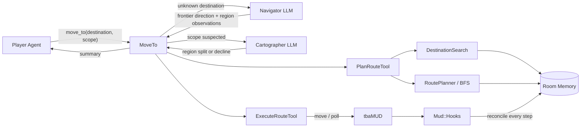
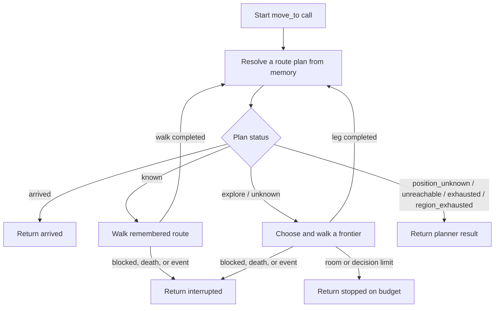
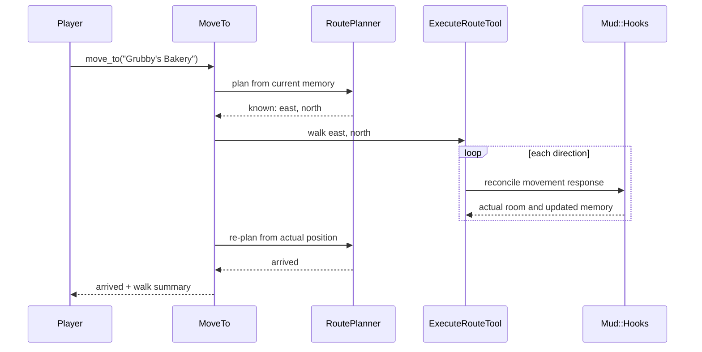
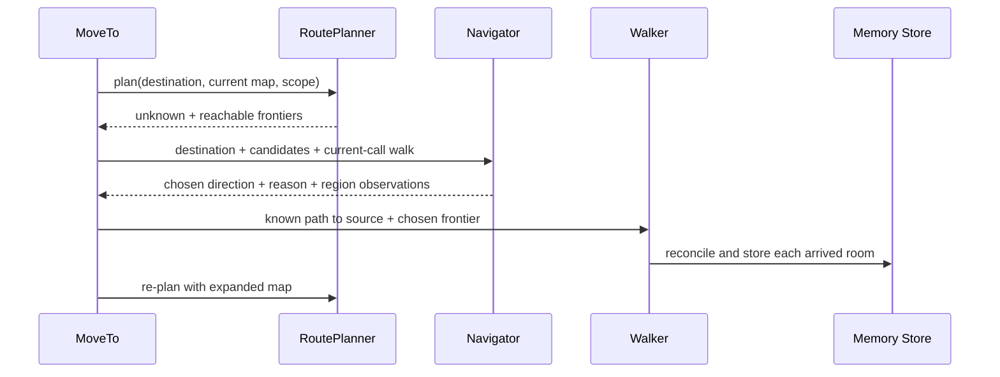
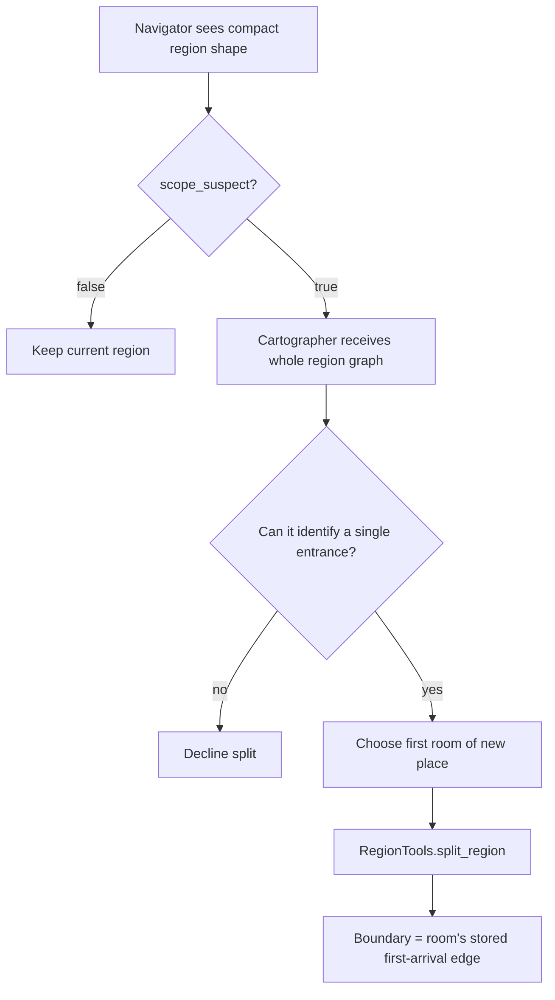
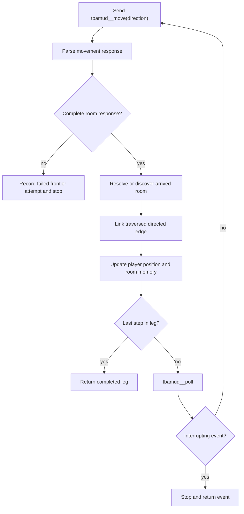
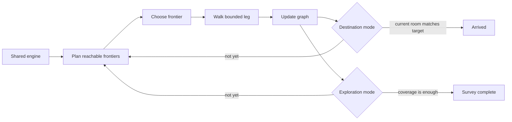

# How `move_to` Works

This document explains the `move_to` system as it exists today. Its purpose is
to make the code understandable enough to change deliberately, without having to
reconstruct the architecture from implementation comments and planning notes.

The most important fact is:

> `move_to` is a bounded, destination-seeking loop over the agent's remembered
> room graph.

It is not currently a general exploration mission system. It can explore while
looking for an unknown destination, but it has no representation of a goal such
as "map Midgaard broadly," no persistent exploration preferences, and no
"mapped enough" completion test.

## 1. Why `move_to` exists

Originally, the player could choose among three movement mechanisms:

- `tbamud__move` for one direction;
- `plan_route` to find a path or list unexplored exits;
- `execute_route` to walk a known path.

This made the desired sequence optional. Even when the player initially planned
a route, it could return to issuing one `move` per model iteration. That was both
expensive and unreliable.

`move_to` removes that choice from the player's tool surface:

```text
move_to(destination: "the bakery", scope: "region")
```

The player states where it wants to go. The subsystem decides whether to:

- return immediately because the player is already there;
- walk a remembered route without an LLM decision;
- ask the Navigator to choose among unexplored exits;
- stop because it is blocked, interrupted, out of budget, or out of frontiers.

`plan_route`, `execute_route`, and `tbamud__move` still exist internally. They
are composed behind `move_to` rather than exposed as competing movement choices.

## 2. Architecture at a glance



The components have deliberately different responsibilities:

| Component | Responsibility | Uses an LLM? |
|---|---|---:|
| Player Agent | Names the destination and chooses regional or world scope | Yes |
| `MoveTo` | Owns the loop, budgets, branch selection, walking, and final report | No |
| `PlanRouteTool` | Builds a route plan from memory | No |
| `DestinationSearch` | Finds remembered rooms matching the destination text | No |
| `RoutePlanner` | Runs BFS and ranks reachable frontiers | No |
| Navigator | Chooses one frontier using destination and exit-name meaning | Yes |
| Cartographer | Places or declines a region boundary after suspicion is raised | Yes |
| `ExecuteRouteTool` | Walks a sequence of directions and polls for interruptions | No |
| `Mud::Hooks` | Identifies each arrived room and updates memory immediately | No |
| `RegionTools` | Applies region names and exact first-arrival boundaries | No |

## 3. The public contract

The player sees one movement tool:

```ruby
move_to(destination:, scope: "region")
```

### `destination`

Free text naming a place, landmark, entity, or thing:

```text
"the bakery"
"Temple Square"
"the mayor"
```

The destination is always interpreted as something to find and eventually
arrive at. Today the implementation does not reject bare directions such as
`"south"`, even though a direction is not a destination.

### `scope`

`scope` controls only where the subsystem may explore for an unknown
destination:

- `"region"` searches unexplored exits belonging to the current region and its
  child regions;
- `"world"` allows unexplored exits anywhere reachable on the remembered map.

Scope does **not** constrain travel to a known destination. If the bakery is
already mapped, `move_to` may cross region boundaries to reach it regardless of
the scope argument.

Widening from region to world is intentionally a player decision. When every
reachable frontier is outside the current region, `move_to` returns
`region_exhausted` and suggests the corresponding `scope: "world"` call. It
does not widen silently.

## 4. The central loop

Every `move_to` call creates fresh call-local state:

- destination query;
- scope;
- completed legs;
- rooms walked;
- Navigator decisions used;
- terminal status and explanation.

It then repeatedly plans from the player's current remembered position.



Replanning is the heart of the design. A decision is never assumed to remain
correct indefinitely:

1. Plan using current memory.
2. Walk a bounded leg.
3. Reconcile every arrived room into memory.
4. Plan again from the actual new position.

This is how an initially unknown destination can become known midway through
one call.

## 5. How planning works

Planning is read-only. It performs no MUD commands and does not issue a hidden
`look`.

### 5.1 Destination matching

`DestinationSearch` searches only the agent's memory:

- room names;
- remembered entities;
- room descriptions and locally generated look candidates;
- remembered exit target names.

Matches are ranked in tiers, strongest first:

1. exact room name;
2. phrase in a room name;
3. room-name token overlap;
4. remembered entity;
5. description or look-candidate evidence;
6. exit target name.

Only tiers 1–4 decisively identify a destination room. Description and exit-name
matches are clues for exploration, not proof that the matching room is the
destination.

### 5.2 The remembered graph

Rooms are vertices. A linked exit is a directed edge:

```text
room #7 --south--> room #8
```

An exit whose destination has not been visited is a frontier:

```text
room #7 --east--> "Main Street" --?--> unknown room
```

`RoutePlanner` runs breadth-first search over linked directed edges. From that
it obtains:

- every reachable remembered room;
- the shortest known path to each room;
- the distance and path to each reachable frontier's source room.

### 5.3 Plan statuses

```mermaid
stateDiagram-v2
    [*] --> position_unknown: no current room
    [*] --> arrived: decisive match is current room
    [*] --> known: decisive match is reachable
    [*] --> unreachable: decisive match exists but no linked path reaches it
    [*] --> explore: no decisive room; a frontier has destination evidence
    [*] --> unknown: no decisive room and no frontier has destination evidence
    [*] --> region_exhausted: frontiers exist, but all are outside regional scope
    [*] --> exhausted: no reachable frontier exists
```



The `known` and `arrived` statuses depend on lexical destination matching.
`explore` and `unknown` depend on reachable frontiers.

### 5.4 Frontier ranking

The deterministic planner ranks frontiers lexicographically by:

1. whether the frontier target name directly clues the destination;
2. how strongly the frontier's source room matches the query;
3. how many region changes the known path crosses;
4. BFS distance to the frontier's source room;
5. previous failed attempts on that frontier;
6. canonical direction order;
7. source room ID.

This ranking provides a safe fallback and controls display order. It does not
claim to understand what room names mean. That semantic choice is why the
Navigator exists.

## 6. Known destination: no reasoning call

Suppose memory contains:

```text
Temple Square --east--> Market Street --north--> Grubby's Bakery
```

A call to:

```text
move_to(destination: "Grubby's Bakery", scope: "region")
```

produces a `known` plan with `east → north`. `MoveTo` passes those directions
straight to the walker. The Navigator and Cartographer are not needed.



Known routes are therefore cheap at the model layer: the player makes the
`move_to` call, but the path itself requires no per-room LLM decision.

## 7. Unknown destination: Navigator-assisted exploration

When no remembered room decisively matches the destination, the planner returns
reachable frontiers. Each candidate includes:

- the direction of the unexplored exit;
- the target name printed by the MUD, if known;
- the source room;
- distance from the current room;
- the remembered walk to that source room.

For example:

```json
{
  "destination": "the bakery",
  "here": "The Temple Of Midgaard (#1)",
  "candidates": [
    {
      "direction": "north",
      "leads_to": "By The Temple Altar",
      "from": "The Temple Of Midgaard",
      "moves_away": 0,
      "walk": []
    },
    {
      "direction": "south",
      "leads_to": "The Temple Square",
      "from": "The Temple Of Midgaard",
      "moves_away": 0,
      "walk": []
    }
  ],
  "walked_so_far": []
}
```

The Navigator returns exactly one small JSON decision:

```json
{
  "direction": "south",
  "reason": "A square is a stronger route toward city shops than a temple altar.",
  "place": null,
  "scope_suspect": false,
  "scope_reason": null
}
```

`MoveTo` validates the answer against the candidate list. If multiple
candidates use the same direction from different source rooms, the nearer one
wins. If the Navigator names no valid direction, the subsystem uses the
planner's top-ranked frontier and records that fallback.

The selected leg consists of:

```text
known walk to frontier source + unexplored direction
```

It is truncated by both `max_steps_per_leg` and the remaining room budget.
After the leg, planning starts again.



### What the Navigator remembers

Each Navigator decision runs in a fresh small context. It receives
`walked_so_far`, but that field contains only rooms walked earlier in the
current `move_to` call.

It does not receive:

- chronological movement from previous `move_to` calls;
- previously chosen frontiers across the session;
- branch coverage metrics;
- a persistent exploration mission;
- player conversation history;
- preferences such as "stay outdoors" or "spread across several streets,"
  unless they happen to be encoded in the destination or added to its payload.

This limitation matters for broad surveying. The Navigator can choose a
promising frontier toward a bakery, but it cannot currently maintain a
long-running strategy for mapping a city.

## 8. Regions and scope

Regions are remembered groupings of rooms. They influence unknown-destination
exploration, not known-route travel.

Newly derived regions can begin with a provisional label such as:

```text
⟨from The Temple Of Midgaard⟩ — unconfirmed
```

The Navigator has two secondary responsibilities related to regions.

### 8.1 Naming an unconfirmed region

The Navigator may return a `place` value when it can identify the larger place
the player is standing in. `MoveTo` applies that value through
`RegionTools.name_region` before walking the next leg.

This renames the existing region; it does not create a boundary.

The write occurs only when:

- `tools.navigation.act_on_place` is enabled;
- a current region exists;
- the region is not already confirmed;
- the answer is not null or one of the "unchanged" values.

### 8.2 Detecting that a region has become too broad

Once the current region contains at least `min_rooms_for_scope_check` rooms, the
Navigator also receives a region-shape question. The region shape contains:

- room count;
- reachable unexplored exit count;
- nearest frontier distance;
- median frontier distance.

The Navigator may answer `scope_suspect: true` when those facts suggest that
one region label has grown to cover distinct places.

This is only a suspicion. The Navigator does not choose the boundary.

## 9. What the Cartographer actually does

The Cartographer is not an exploration strategist and does not select
frontiers. It answers one narrow question:

> If the current region should be split, at which remembered room did the new
> place begin?

It runs only when all of the following are true:

- a Cartographer task is configured;
- a current region exists;
- the minimum-room gate is open;
- the Navigator returned `scope_suspect: true`.



The Cartographer receives:

- current room;
- the Navigator's reason for suspicion;
- every room in the region;
- each room's first-arrival source and direction;
- distance of each room from the current position;
- unexplored exits attached to each room;
- all known linked edges inside the region.

It may either:

```json
{
  "split_at_room_id": 12,
  "label": "The Mayor's Residence",
  "within": "Midgaard",
  "reason": "The interior rooms hang from one entrance at room 12."
}
```

or decline:

```json
{
  "split": false,
  "reason": "The region is large but remains one interconnected street network."
}
```

The chosen room must belong to the region. `RegionTools.split_region` places
the boundary on the edge by which that room was first discovered:

```text
first_entered_from --first_entered_by--> split_at_room
```

That first-arrival edge is stored at room discovery time. It lets the
Cartographer place a boundary several legs after it was crossed without guessing
which edge introduced the room.

The Cartographer sees the accumulated graph, but not a chronological traversal
history. Its graph input is designed for boundary placement, not for judging
whether previous exploration was broad or repetitive.

## 10. Walking and immediate reconciliation

`ExecuteRouteTool.walk` executes one direction at a time through the navigation
permission slice.



After every successful move, `Mud::Hooks#reconcile_move!`:

1. parses the room response;
2. resolves whether this is a known, new, or ambiguous room;
3. records new rooms, exits, and surveyed entities;
4. links the traversed exit from the previous room to the arrived room;
5. updates the stored player position;
6. records the frontier attempt as successful.

If movement does not produce a complete room response, the attempt is recorded
as failed and the leg stops.

Between steps, the walker polls for interrupting events. Combat, death, or
another classified interruption stops the route and returns control to the
player instead of blindly completing the remaining directions.

### Directed-edge consequence

The traversed edge is linked only in the direction walked. Walking:

```text
A --south--> B
```

does not create:

```text
B --north--> A
```

unless that reverse direction is separately traversed and reconciled. Because
BFS uses linked directed edges, missing reverse links can make a previously
visited room appear unreachable from the current position.

This is deliberate rather than a defect. `docs/plans/week_2/plan_route.md`
states the rule directly—"Do not infer a reverse edge"—on the grounds that MUD
exits may be one-way, gated, or non-Euclidean, so a manufactured return edge
would produce routes the agent cannot walk. The decision is enforced by
`test_one_way_exits_are_not_reversed` and by the store invariant at
`memory/store.rb:365`, where `link_exit!` is the only writer of
`target_room_id`.

What is genuinely defective is adjacent to it. The MUD's `exits` output names
the room behind each exit, and `room_parser.rb:113` already parses those names
into `room_exits.target_name`, but nothing compares them against rooms already
in memory. An exit leading to a thoroughly mapped room is therefore stored and
planned exactly like an exit leading somewhere unknown. In the recorded
Midgaard map five of fifteen unlinked exits name rooms already visited, which
both inflates the frontier set and leaves the agent unable to plan a route out
of the room it finished in.

The fix is exit name resolution rather than reverse inference, and it recovers
structure that symmetry assumptions cannot—room 1 has both a `south` and a
`down` exit to The Temple Square, and only `south` was ever walked. See
`docs/plans/week_3/exit_name_resolution.md`.

## 11. Budgets and stopping conditions

One `move_to` call is intentionally bounded:

| Setting | Default | What it bounds |
|---|---:|---|
| `max_rooms` | 12 | Total successfully walked rooms |
| `max_decisions` | 6 | Navigator calls |
| `max_steps_per_leg` | 4 | Distance walked before replanning |
| `min_rooms_for_scope_check` | 3 | When region-scope suspicion may be requested |

`max_rooms` and `max_decisions` protect different resources. A long known
corridor may consume many rooms with no Navigator calls. A dense unknown area
may consume several Navigator calls while moving only a few rooms.

`max_steps_per_leg` is the compromise between two failures:

- too high: one stale semantic decision can carry the player far away;
- too low: the design regresses to one LLM decision per room.

After every completed leg, `MoveTo` replans before checking the next branch's
budget. Therefore, if the final permitted step reaches the destination, the
result is honestly `arrived` rather than `stopped on budget`.

The call can end with:

- `arrived`;
- `budget`;
- `interrupted`;
- `position_unknown`;
- `unreachable`;
- `exhausted`;
- `region_exhausted`;
- `navigator_failed`;
- `no_direction`;
- a validation or internal error.

## 12. What the player receives

The final rendering preserves information that batching would otherwise hide:

- the terminal status;
- why the call stopped;
- every leg and direction walked;
- the Navigator's reason for each semantic frontier choice;
- whether a deterministic fallback replaced an invalid Navigator answer;
- interruption text;
- total rooms, legs, and decisions;
- final remembered position;
- planner remediation text where applicable.

Conceptually:

```text
[move_to] the bakery — stopped on budget
max_rooms (12) reached
leg 1: south → east → Market Street
  chose east (Main Street): shops are more likely along a main street
leg 2: north → Grubby's Bakery
  chose north (Grubby's Bakery): the exit directly names the destination
walked 12 rooms in 2 legs, 2 decisions
here: Grubby's Bakery (#42)
```

The actual status would be `arrived` if replanning matched the final room.

## 13. Persistent state versus call-local state

Understanding this boundary explains much of the current behavior.

### Persistent in the memory store

- rooms and room descriptions;
- directed exits and optional target names;
- entities observed in rooms;
- current and previous player position;
- successful and failed frontier attempts;
- first-arrival edge for each room;
- regions, parent regions, and declared boundaries.

### Local to one `move_to` call

- destination and scope;
- rooms walked during the call;
- legs and their decision explanations;
- number of Navigator decisions;
- `walked_so_far` sent to the Navigator;
- budget status.

### Not represented today

- a durable exploration mission;
- mission preferences;
- chronological cross-call movement history for the Navigator;
- branch-level coverage;
- outdoor/interior classification;
- semantic progress such as "both banks of the river";
- a definition of "this area is mapped enough."

## 14. Current limitations and known defects

These are architectural facts or observed defects, not capabilities supplied by
the prompts.

### `move_to` is destination-shaped

Every successful call is trying to make a room match `destination`. Asking it
to "map Midgaard" forces the player to invent successive destination names
because there is no coverage objective or coverage completion condition.

### Bare directions are accepted as destinations

`move_to(destination: "south")` passes validation. The Navigator can then
rationalize choosing south repeatedly. No current guard requires a destination
to name a place.

### Navigator history is call-local

The Navigator can see rooms walked in the current call, but not the route
strategy across earlier calls. It cannot reliably enforce "do not keep following
one road" across a session.

### Cartographer does not guide exploration

The Cartographer places region boundaries only. It does not receive mission
preferences and does not choose the next frontier.

### Semantic constraints lack metadata

There is no stored, trustworthy `interior`, `street`, `square`, `quarter`, or
`river_bank` classification. A rule such as "stay outdoors" cannot currently be
enforced mechanically.

### Destination matching can produce false `arrived`

The current token-overlap rule accepts one shared content word. Generic MUD room
words such as "square" or "temple" can therefore identify the wrong remembered
room. Tightening this rule is proposed but not yet reflected in the current
implementation.

### Exit target names are never resolved against known rooms

Only traversed directions are linked, which is intended. The defect is that an
unlinked exit whose MUD-reported `target_name` matches a room already in memory
is still treated as unexplored. This damages backtracking, inflates the
frontier set, and can turn a reachable remembered destination into
`unreachable`. See the directed-edge discussion in section 10 and
`docs/plans/week_3/exit_name_resolution.md`.

### Some terminal results offer no recovery action

`unreachable` and false `arrived` outcomes can repeat because they currently
return before offering the frontiers that might repair the map.

## 15. Where an exploration objective would fit

A future exploration feature does not need a different walking engine. It would
reuse:

- the room graph;
- BFS paths to frontier sources;
- frontier candidates;
- Navigator or deterministic frontier selection;
- bounded legs;
- per-step reconciliation;
- interruption handling.

The architectural difference is the objective and termination test:



The unresolved work is not how to walk to a frontier. It is:

1. how a user request becomes durable exploration preferences;
2. what history or derived branch metrics frontier selection receives;
3. which preferences are enforceable facts versus subjective guidance;
4. what observable condition means "mapped enough";
5. whether the Navigator remains the chooser or a separate exploration
   strategist is introduced.

Until those are implemented, `move_to` should be understood and evaluated as a
destination-seeking tool that can perform incidental exploration—not as a
general regional survey tool.

## 16. Code map

The main implementation is under `week2_capable/boukensha`:

| File | Purpose |
|---|---|
| `lib/boukensha_loader.rb` | Registers the public tool, permissions, and dependencies |
| `lib/boukensha/mud/navigation/move_to.rb` | Main loop, budgets, Navigator and Cartographer orchestration, rendering |
| `lib/boukensha/mud/navigation/plan_route_tool.rb` | Store snapshot and plan rendering |
| `lib/boukensha/mud/navigation/route_planner.rb` | BFS, statuses, frontier ranking and grouping |
| `lib/boukensha/mud/navigation/destination_search.rb` | Lexical destination search |
| `lib/boukensha/mud/navigation/execute_route_tool.rb` | Per-step walking and event polling |
| `lib/boukensha/mud/hooks.rb` | Room resolution and immediate movement reconciliation |
| `lib/boukensha/mud/navigation/region_tools.rb` | Region naming, splitting, and shape |
| `lib/boukensha/mud/navigation/reasoners.rb` | Fresh task calls and JSON parsing |
| `lib/boukensha/tasks/navigator.rb` | Navigator task definition |
| `prompts/navigator/system.md` | Navigator decision contract |
| `lib/boukensha/tasks/cartographer.rb` | Cartographer task definition |
| `prompts/cartographer/system.md` | Cartographer boundary-placement contract |
| `.boukensha/settings.yaml` | Models, permission slice, limits, and feature switches |

## 17. A practical debugging checklist

When `move_to` behaves incorrectly, first identify which layer owned the bad
answer:

1. **Wrong `arrived` or wrong known destination:** inspect
   `DestinationSearch` match tier and evidence.
2. **Destination remembered but `unreachable`:** inspect directed linked edges
   from the current room, especially missing return edges.
3. **Bad frontier list:** inspect reachable unlinked exits, scope region IDs,
   and frontier attempt counts.
4. **Good candidates, bad semantic choice:** inspect the Navigator payload and
   response.
5. **Navigator chose a direction not actually used:** inspect candidate
   direction ambiguity and the recorded fallback.
6. **Wrong room after walking:** inspect `reconcile_move!`, fingerprints,
   arrival edge, and stale-edge correction.
7. **Walk stopped early:** distinguish blocked movement, death, interrupting
   poll event, `max_rooms`, and `max_decisions`.
8. **Wrong region label:** distinguish `place`/`name_region` from a true
   `split_region`.
9. **Wrong region boundary:** inspect `scope_suspect`, the Cartographer graph
   payload, `split_at_room_id`, and that room's first-arrival edge.
10. **Repetitive regional survey:** do not assume Cartographer failure; persistent
    exploration intent and cross-call coverage history do not exist yet.
