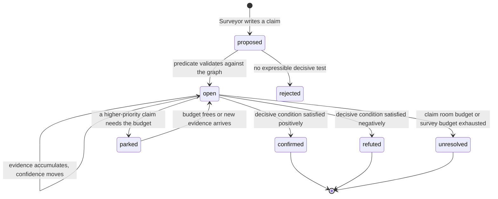

# Claim-Driven Surveying

## The proposal

A survey is currently modelled as coverage: walk enough rooms, touch enough
branches, then ask a reasoner whether that felt like enough. This document
proposes modelling a survey as an investigation instead. The Surveyor maintains
a ledger of falsifiable claims about the region, and the deterministic planner
selects frontiers according to which claim each frontier is most likely to
settle. The survey ends when no open claim has a decisive test remaining within
budget, and the answer returned to the player is the ledger itself.

The change matters because coverage metrics do not encode what the survey is
trying to find out. A count of fourteen rooms carries no information about
whether the player's question was answered, which is why the design in
[surveyor_architecture.md](surveyor_architecture.md) has to negotiate
completion between an arbitrary `min_rooms` floor and an unfalsifiable
judgement call. A claim, by contrast, states what would settle it, so both
frontier selection and termination follow from the same structure.

## What a claim is

A claim is a proposition about the region that the survey can gather evidence
for or against, paired with a machine-checkable condition describing what would
settle it. The natural-language statement exists for the player's benefit and
for the Surveyor's own reasoning, whereas the predicate is what the planner
acts on.

```json
{
  "id": "claim-6",
  "statement": "A road runs along the inside of Midgaard's wall and forms a closed circuit around the town.",
  "predicate": "circuit_closes",
  "subject": "feature:wall_road",
  "status": "open",
  "confidence": 0.55,
  "answers": "town extent",
  "priority": 0.8,
  "decisive_when": "a wall-road room is re-entered from an edge not previously walked, or a wall-road segment terminates with no wall-adjacent continuation",
  "evidence": [
    {
      "room_id": 23,
      "polarity": "support",
      "note": "room name and description place a road immediately inside a city wall"
    }
  ],
  "room_budget": 14,
  "rooms_spent": 3
}
```

Three fields carry most of the weight. The `predicate` binds the claim to a
scoring function the planner already knows how to run, which is what prevents
"gather evidence" from remaining a vague instruction. The `evidence` array
records `polarity` explicitly so that the ledger can accumulate disconfirmation
rather than only accumulating support. The `room_budget` bounds the
investigation, because a claim such as circuit closure can consume an entire
survey if nothing stops it.

## The predicate vocabulary

Predicates are a closed set. The Surveyor may write any statement it likes, but
it must classify that statement under one of these predicates, and a claim
whose statement cannot be expressed as a predicate over the room graph is
rejected before it enters the ledger. Each predicate defines both the condition
under which the claim is settled and the function that scores candidate
frontiers while the claim remains open.

| Predicate | Settled when | Frontier scoring |
|---|---|---|
| `composition(subject, classes)` | every named class has a confirmed instance, or the rate of newly discovered classes per leg falls below a saturation threshold | prefers frontiers in branches whose observed class mix is least represented |
| `exists(class)` | an instance of `class` is classified above the confidence threshold, or the in-scope frontier set empties | prefers frontiers whose target name or source-room description lexically clues `class` |
| `count_at_least(class, n)` | `n` distinct instances observed, or frontiers exhausted | as `exists`, but continues past the first instance |
| `extent_bounded(subject)` | the in-scope frontier set empties, or the room count exceeds the stated ceiling | prefers the nearest frontier, which exhausts the frontier set at the lowest walking cost |
| `circuit_closes(feature)` | a feature-tagged room is re-entered by a previously unwalked edge, or a feature chain terminates without continuation | prefers frontiers adjacent to feature-tagged rooms, favouring the unexplored end of the longest feature chain |
| `bounds(feature, subject)` | every frontier crossing the feature outward leaves rooms classified as `subject` behind it | prefers frontiers that cross the feature outward exactly once |
| `region_distinct(subset, parent)` | a single-entrance cut exists and the classification contrast across it exceeds threshold, or no such cut exists | prefers frontiers leading deeper into `subset` |
| `connects(a, b)` | a path between `a` and `b` exists through feature-tagged rooms | prefers frontiers extending the feature chain in the direction of `b` |
| `spans(subject, feature)` | rooms classified `subject` are observed on both sides of `feature` | prefers frontiers that cross `feature` |

The strategies enumerated in [strategies.md](strategies.md) all reappear here
as scoring functions rather than as configuration. Following a wall until it
closes is what `circuit_closes` scores for, sampling widely across branches is
what `composition` scores for, exhausting a bounded area cheaply is what
`extent_bounded` scores for, and pushing one branch until it reads as a
different place is what `region_distinct` scores for. Nothing selects a
strategy, because the open claim set produces the behaviour that its predicates
imply, and that behaviour changes as claims are settled and retired.

## Who decides what

The most significant consequence of this model is that the Surveyor stops
selecting frontiers. In the design described in
[surveyor_architecture.md](surveyor_architecture.md) the Surveyor returns a
`frontier_id`, which means the semantic reasoner is making a movement decision
on every leg and `MoveTo` is left validating that decision after the fact.
Under claim-driven surveying the Surveyor only maintains the ledger, and the
planner computes frontier scores from the open claims, so movement selection
returns entirely to deterministic code.

| Component | Responsibility | Uses an LLM? |
|---|---|---:|
| Player Agent | States the survey objective in natural language | Yes |
| `MoveTo` | Owns the loop, budgets, walking, and terminal status | No |
| Claim Planner | Scores frontiers against open claims and evaluates decisive conditions | No |
| Surveyor | Opens, revises, and retires claims from accumulated evidence | Yes |
| Room Observer | Classifies what is visible in the current room | Existing call |
| Cartographer | Places an exact boundary once a `region_distinct` claim is confirmed | Yes |
| `ExecuteRouteTool` | Walks the selected route and polls for interruptions | No |

Frontier arbitration across several open claims is a weighted vote. Each open
claim contributes `priority × predicate_score(frontier)` to every candidate,
the totals are divided by the walking cost of reaching each candidate, and the
existing deterministic ranking described in `docs/architecture/move_to.md`
breaks ties. Because scoring is arithmetic over the ledger, the same ledger and
the same graph always produce the same next leg, which makes survey behaviour
reproducible in a way that per-leg frontier selection by a reasoner is not.

## The claim lifecycle



An `unresolved` claim is a successful outcome rather than a failure, because
"the wall road runs along the north, east, and south sides, and the western
continuation was not reached" answers the player's question more usefully than
a room count does. A `refuted` claim is equally valuable, since establishing
that Midgaard has no second bridge is a finding.

## Seeding, revision cadence, and hygiene

At the start of a survey there is no accumulated evidence to hypothesise from,
so the Surveyor's first call receives only the objective text and the current
room and is asked to produce seed claims directly from the objective. An
objective such as "walk around town and determine the size of the town and what
it offers" yields a `composition` claim covering the town's offerings and an
`extent_bounded` claim covering its size, both at low confidence. Subsequent
calls receive the ledger plus the evidence gathered since the previous call and
may open new claims, revise confidence, or retire claims.

The Surveyor does not need to run after every leg. When a completed leg
produces no new room classification, extends no feature chain, and trips no
predicate's decisive condition, the planner continues on the existing ledger
without a reasoner call, which bounds cost the same way `max_decisions` bounds
Navigator calls today. Calls are also forced whenever a decisive condition
fires, because a settled claim usually changes what is worth investigating
next.

Three hygiene rules keep the ledger usable. The number of simultaneously open
claims is capped, with the lowest-priority claims parked rather than dropped so
that their evidence survives. A claim must name a decisive condition
expressible over the room graph, which rejects unfalsifiable statements such as
"the town is prosperous" at validation time. Finally, a proposed claim whose
predicate and subject match an existing claim merges into it rather than
creating a duplicate, so that evidence accumulates in one place.

## Durability

Claims persist in region memory rather than living for the duration of one
`move_to` call. This is the strongest practical argument for the model, because
the call-local coverage counters listed under "Local to one `move_to` call" in
`docs/architecture/move_to.md` cannot carry anything forward: a record of
fourteen rooms walked means nothing at the start of the next session, whereas a
`circuit_closes` claim standing at three sides confirmed and one side
unexplored tells the next survey exactly where to resume.

Persistence needs two tables. A `claims` table holds the ledger keyed by
region, carrying the predicate, subject, statement, status, confidence,
priority, and budget accounting. A `claim_evidence` table holds one row per
observation, referencing the room that produced it along with its polarity and
note, which keeps evidence attached to the graph so that a claim can be
re-evaluated if the room graph is later corrected.

## Relationship to the Cartographer

Region-scope suspicion stops being a side channel. The `scope_suspect` flag
that the Navigator returns today, and that
[surveyor_architecture.md](surveyor_architecture.md) carries forward into the
Surveyor's response, becomes an ordinary claim with the `region_distinct`
predicate. It accumulates evidence like any other claim, it competes for
frontier attention on priority like any other claim, and it can be refuted.
The Cartographer then runs only when such a claim is confirmed, and its job
narrows to placing the exact boundary on the first-arrival edge, which is the
operation it was already designed to perform.

## What this does not change

The walking engine is untouched. Breadth-first search over the remembered
graph, bounded legs, per-step reconciliation through `Mud::Hooks`, interruption
polling, and the hard `max_rooms` and `max_steps_per_leg` budgets all behave
exactly as `docs/architecture/move_to.md` describes. The known defects
documented there affect claim-driven surveying in the same way they affect
destination-seeking travel, and the one that matters most here is the failure
to resolve exit target names against known rooms, since a survey that must
backtrack along an unlinked edge will be damaged by it regardless of how
frontiers are chosen. That fix is specified in
[exit_name_resolution.md](../exit_name_resolution.md).

## What the planner needs, and what it does not

Predicates such as `composition` and `region_distinct` talk about kinds of
place, which invites the assumption that they depend on the stored room
ontology sketched in [room_metadata.md](room_metadata.md). They do not, and
being precise about why matters, because that ontology is a large piece of
speculative work whose own document concedes the vocabulary is not yet
derivable.

Class labels live in the ledger rather than on rooms. A `composition` claim
already carries the classes it has observed, and each `claim_evidence` row
already points at the room that contributed one, so the Surveyor recording
"this is lodging, and lodging is already represented" *is* the classification,
and it persists across sessions with the claim. Nothing needs a `place_type`
column for that to work. The arrangement is also better than a fixed ontology
rather than merely cheaper, because the class vocabulary arrives with the
objective: a survey asking what a town offers seeds commercial, civic, and
religious classes, whereas a survey asking whether a town is defensible seeds
walls, gates, and chokepoints. A global ontology would have to be the union of
every question anyone might ask, which is why enumerating survey prompts to
reverse-extract it feels unbounded.

Structural signals carry more of the frontier scoring than semantics do. Rooms
4, 5, and 6 of the recorded Midgaard map are reachable only through room 3,
which makes them a single-entrance subtree behind an articulation point, and a
survey seeking breadth can discount frontiers inside such a cluster using graph
math alone. Lexical classification would have failed on that case in any event,
since "The Reception" and "The Post Office" share no vocabulary with "The
Entrance Hall Of The Grunting Boar Inn"; what relates them is adjacency.
Cluster membership, distance from the explored mass, exit degree, and
articulation points are all computable today.

What the planner genuinely cannot compute is a guess about the room behind an
unwalked exit, since it sees only the exit's target name. Rather than requiring
a deterministic classifier for that, the Surveyor annotates open frontiers with
expected-class hints when it revises the ledger. It is already reading those
exits in `new_evidence`, so the annotation is free, and it places the semantic
guess in the component that should be making semantic guesses.

Feature membership is the one durable per-room tag the model does require,
because `circuit_closes`, `connects`, and `bounds` all depend on deciding that
several separately observed rooms belong to one road or one wall. That is a
single join table relating features to rooms with supporting evidence, and it
is the entity-resolution problem [landmarks.md](landmarks.md) raises rather
than the ontology `room_metadata.md` proposes. Until feature chains can be
assembled reliably, those three predicates will be weaker than the table above
suggests.

## Open questions

The saturation threshold in `composition` needs calibration against real
sessions, because it is the rule that decides when a survey has seen enough
kinds of place, and setting it badly reproduces the arbitrariness of
`min_rooms` in a less legible form.

Claim priority is unspecified. Whether a survey traces a wall or investigates a
side quarter follows from the priorities attached to those claims, and the
model currently offers no rubric for setting them, so an implementation needs
either a standard the Surveyor applies consistently or a deterministic
derivation from how directly a claim serves the stated objective.

See [session_story.md](session_story.md) for a walkthrough of how this behaves
across two sessions in Midgaard.
