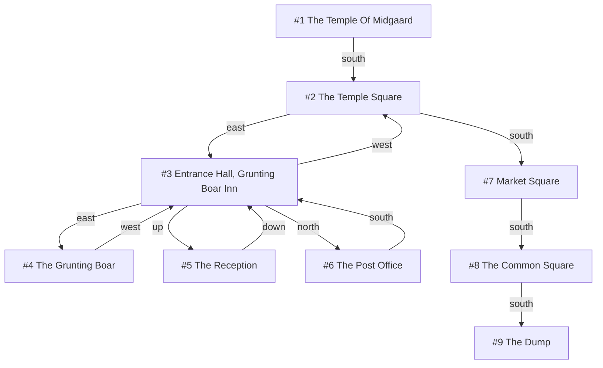

# Session Story

## What this document is

This is a walkthrough of what a claim-driven survey would actually look like
from the first call to the final report, and then across a session boundary.
Its purpose is to make the model in [claims.md](claims.md) concrete enough to
argue with, because a predicate table does not reveal whether the resulting
behaviour is sensible and a narrative does.

The first half is grounded in real recorded data. Rooms 1 through 9 and every
exit named below were read from `.boukensha/profiles/Derrano/knowledge.sqlite3`
as it stands on 2026-07-30, so the topology, the exit names, and the order of
the recorded walk are facts rather than invention. The second half, covering
everything west of Market Square, is **projected**: those rooms have not been
visited, and the names used for them are illustrative placeholders chosen to
carry the example. Every projected section is marked as such.

## The recorded baseline

The map currently in memory came from a Navigator-driven run that walked twelve
moves across nine distinct rooms, starting at The Temple Of Midgaard and ending
at The Dump.



Four of those nine rooms are the interior of one inn. The run entered the
Entrance Hall, stepped east into the bar, came back, went up to the Reception,
came back down, went north to the Post Office, and came back again, spending
six of its twelve moves inside a single building before returning to the square
it started from. That is not a Navigator failure in any narrow sense, because
each individual choice was defensible when the only stated goal was to find
somewhere; it is the predictable result of asking a destination-seeking loop to
perform a survey, which is the problem `docs/architecture/move_to.md` describes
in its section on `move_to` being destination-shaped.

The run also ended badly. The Dump has one recorded way out, north to The
Common Square, and that exit is stored with no linked target room because it
was never walked in that direction, so breadth-first search cannot currently
route the player back out of the room it finished in. The exit does name its
destination, because the MUD reports it, but that name is never matched against
the room already in memory; see
[exit_name_resolution.md](../exit_name_resolution.md). It is worth noting up
front that claim-driven surveying does nothing to fix this on its own.

## Session one, under claim-driven surveying

The player agent issues a single call:

```ruby
move_to(
  objective: {
    type: "survey",
    scope: "Midgaard",
    question: "Walk around town and determine the size of the town and what it offers"
  },
  budget: { max_rooms: 30, max_legs: 14 }
)
```

The map starts empty apart from the current room, matching the state the
recorded run began from.

### Seeding the ledger

Before any movement, the Surveyor is called once with the objective text and
the current room, and it converts the question into two seed claims. It has no
evidence yet, so both open at low confidence.

| ID | Statement | Predicate | Priority | Confidence |
|---|---|---|---:|---:|
| C1 | Midgaard's offerings span a describable set of classes | `composition(Midgaard, [commercial, civic, religious, residential, transport, lodging])` | 1.0 | 0.2 |
| C2 | Midgaard is a settlement of walkable, bounded extent | `extent_bounded(Midgaard)` | 0.9 | 0.3 |

These two claims are enough to drive the whole first phase of the survey, since
one asks what is here and the other asks how far it goes.

### Leg 1: the temple interior is declined

The player stands in The Temple Of Midgaard, whose recorded exits offer four
frontiers: north to By The Temple Altar, east to The Midgaard Donation Room,
west to The Reading Room, and south to The Temple Square.

C1 scores each frontier by how poorly its likely class is represented in what
has been observed. The current room has already contributed a religious
classification, and the target names of the altar, the donation room, and the
reading room all clue further religious interior, so all three score low. The
Temple Square clues an outdoor public space, which is a class not yet observed,
so it scores high. C2 prefers the nearest frontier and cannot discriminate,
because every candidate is zero moves away.

The planner walks south to The Temple Square. The interesting part is that
three plausible rooms were skipped without a reasoner being consulted about
them, and the reason is recorded in the ledger rather than in a Navigator
rationale that disappears at the end of the call.

### Leg 2: the inn is sampled once, not four times

From The Temple Square the frontier set grows to include east toward The
Entrance Hall Of The Grunting Boar Inn, south toward Market Square, and west
toward The Entrance To The Clerics' Guild, alongside the temple interior exits
still standing behind.

The Clerics' Guild scores low as further religious interior. Both the inn and
Market Square clue unobserved classes, lodging and commercial respectively, and
they score closely enough that the deterministic ranking decides between them;
the planner walks east into the Entrance Hall.

The divergence from the recorded run happens on the next scoring pass. Having
observed the Entrance Hall, C1 now holds a lodging classification, so the
frontiers into The Grunting Boar, The Reception, and The Post Office are scored
as rooms likely to repeat a class the ledger already has. Market Square, still
unobserved and still clueing commercial, outscores all three. The survey leaves
the inn after one room instead of six moves, and the five moves the recorded
run spent on interior detail are available for the rest of the town.

This is the clearest single illustration of what the model buys. The Navigator
had no way to express "we already know what an inn is"; the `composition`
predicate expresses exactly that, and it does so as arithmetic over observed
classes rather than as a judgement call.

### Leg 3: a claim forms from the graph

The player reaches Market Square, and the Room Observer classifies it as an
outdoor commercial space. The recorded exits are north back to The Temple
Square, south to The Common Square, east to Main Street, and **west to Main
Street**.

The Surveyor is called because a new classification has appeared, and the
repeated exit target name gives it something to work with. Two exits on
opposite sides of one square carrying the same road name is evidence that the
road passes through rather than terminates, which the Surveyor writes as a new
claim.

| ID | Statement | Predicate | Priority | Confidence |
|---|---|---|---:|---:|
| C3 | Main Street is a through-road crossing Midgaard from east to west | `connects(feature:main_street, east_edge, west_edge)` | 0.7 | 0.6 |

C3 matters for the survey because a through-road is a cheap way to establish
extent, which is what C2 is trying to settle. Two claims now favour following
Main Street, and their combined weight begins to compete with C1's preference
for sampling new classes.

### Legs 4 and 5: the southern branch, and a claim being parked

C1 still holds priority 1.0 and still wants an unobserved class, so the planner
takes the southern branch. The Common Square yields exits east to The Dark
Alley, west to The Eastern End Of Poor Alley, and south to The Dump, and those
names contribute a residential and notably poor classification that C1 has not
seen.

The Surveyor opens a third claim on that evidence.

| ID | Statement | Predicate | Priority | Confidence |
|---|---|---|---:|---:|
| C4 | The alleys south of the Common Square form a poor quarter distinct from the civic centre | `region_distinct(subset:south_alleys, Midgaard)` | 0.4 | 0.45 |

C4 is genuinely interesting but it competes for budget with C1 and C2, and the
open-claim arbitration gives it a low enough weight that it is parked rather
than pursued. Parking preserves its evidence without spending rooms on it,
which is the mechanism that stops a survey from being derailed by every
plausible observation. Under the current architecture this observation would
either have been lost or would have arrived as a `scope_suspect` flag that
immediately invoked the Cartographer.

The planner does step south to The Dump, because C2 wants the frontier set
drained cheaply and The Dump is one move away. The Dump turns out to be a
terminus whose only other exit is described as "Too dark to tell," and that is
useful negative evidence: a branch that ends contributes support to C2's claim
that the town is bounded.

At this point the ledger stands where the recorded run ended, but it has spent
five rooms rather than nine on reaching the same understanding, and it has
three findings recorded instead of none.

### Legs 6 through 9: following Main Street west

**Projected from here onward. Room names west of Market Square are
placeholders.**

With the southern branch drained and C4 parked, C3 and C2 dominate scoring, and
both prefer the Main Street frontiers. The planner routes back to Market Square
and walks west, and successive rooms confirm a continuous street. C3's
confidence climbs as the feature chain extends.

Around the fourth westward room the Room Observer records a description placing
the road immediately inside a city wall. The Surveyor, called because a new
geographic feature has appeared, opens the claim that motivated this whole
design:

| ID | Statement | Predicate | Priority | Confidence |
|---|---|---|---:|---:|
| C5 | A road runs inside Midgaard's wall and forms a closed circuit around the town | `circuit_closes(feature:wall_road)` | 0.85 | 0.5 |

The behavioural change is immediate and requires no configuration. The
`circuit_closes` scoring function prefers frontiers adjacent to feature-tagged
rooms at the unexplored end of the longest feature chain, which is perimeter
following, and because C5 opens at priority 0.85 against C1's declining
marginal value, the survey turns and begins tracing the wall. Nobody selected a
perimeter strategy; the claim's predicate is the strategy.

C5 also changes what C2 means. A wall that encloses the town settles extent far
more decisively than draining frontiers one at a time, so the two claims
reinforce rather than compete, and C2's own scoring contribution effectively
folds into C5's.

### Legs 10 through 13: budget arrives before closure

The survey follows the wall road north and then east, tagging rooms into the
feature chain as it goes. C5's `room_budget` was estimated at fourteen rooms
when it opened, and by leg thirteen it has spent eleven of them while the
survey as a whole has spent twenty-six of its thirty rooms.

The planner now faces a decision that is arithmetic rather than editorial. Four
rooms remain in the survey budget, the unexplored end of the wall chain is
three moves away, and closing the circuit would plausibly need eight or more.
There is no way to settle C5 within budget, so the claim is marked `unresolved`
with its accumulated evidence intact, and the survey terminates on budget
rather than spending its remaining rooms on an investigation it cannot finish.

### The report

The player receives the ledger, which is the answer to the question that was
asked rather than a summary of walking.

```text
[move_to] survey of Midgaard — stopped on budget (26 of 30 rooms, 13 legs)

Findings
  CONFIRMED  Midgaard's offerings span religious, lodging, commercial,
             civic, residential, and transport places.
             Evidence: Temple of Midgaard, Grunting Boar Inn, Market Square,
             Post Office frontier, Poor Alley approach, Main Street.
  CONFIRMED  Main Street is a through-road crossing the town east to west.
             Evidence: opposing exits share the name at Market Square;
             traced continuously for 7 rooms.
  SUPPORTED  Midgaard is bounded. The southern branch terminates at The Dump;
             a wall encloses the western and northern sides.
  UNRESOLVED A wall road forms a closed circuit around the town.
             North, west, and part of the south are traced. The eastern
             continuation was not reached; roughly 8 rooms remain.
  PARKED     The alleys south of the Common Square may form a distinct
             poor quarter. Not investigated.

here: Along The Northern Wall (#31)
```

Every line is falsifiable, every line names its evidence, and the two
incomplete lines say precisely what would finish them. That last property is
what makes the next session cheap.

## Session two: resuming from the ledger

Because claims persist in region memory rather than in call-local state, a
later survey of Midgaard does not restart from the objective. The Surveyor's
seeding call receives the existing ledger and finds C5 already open at 0.8
confidence with three sides traced, so it proposes no new seed claims at all
and the planner begins scoring immediately.

C5 dominates from the first leg, the perimeter behaviour resumes at the exact
frontier where the previous session stopped, and the circuit closes when the
survey re-enters an already-tagged wall room by an edge it had not walked.

```text
[move_to] survey of Midgaard — surveyed (9 rooms, 4 legs)

  CONFIRMED  A wall road forms a closed circuit around the town.
             Closed at Along The Eastern Wall (#38), re-entered from the
             south by a previously unwalked edge. Circuit length 19 rooms.
  CONFIRMED  Midgaard is bounded: 19 wall rooms enclose 24 interior rooms.
```

Contrast this with the current design, where the only thing carried forward is
the room graph itself. A second survey under coverage metrics would restart its
counters at zero, would have no record that a wall was being followed, and
would have to rediscover from room descriptions that the wall was interesting.
The nine rooms spent here would have been perhaps twenty-five.

## What the story exposes

Three dependencies show up as load-bearing rather than incidental once the
narrative is written out.

Leg 2 turns out not to need classification at all, which is worth stating
plainly because the narrative above justified it semantically. Leaving the inn
after one room was explained as the ledger already holding a lodging class, but
the recorded graph supports the same decision structurally: rooms 4, 5, and 6
are reachable only through room 3, so they form a single-entrance subtree that
a breadth-seeking survey can discount using graph math alone. Lexical
classification would in fact have failed here, since "The Reception" and "The
Post Office" share no vocabulary with "The Entrance Hall Of The Grunting Boar
Inn," and what relates them is adjacency rather than naming.

Leg 1 does need a semantic guess, because declining the temple interior depends
on expecting the altar, the donation room, and the reading room to repeat a
class already observed, and the planner sees only those exit names before
entering. That guess does not require the stored ontology in
[room_metadata.md](room_metadata.md), though. The Surveyor annotates open
frontiers with expected-class hints while revising the ledger, and the class
vocabulary itself lives in the `composition` claim rather than in a room
schema, so it persists across sessions with the claim. See "What the planner
needs, and what it does not" in [claims.md](claims.md).

Feature identity carries legs 6 through 13, because C3 and C5 both depend on
deciding that separately observed rooms belong to one road or one wall.
Assembling those chains from names, descriptions, and adjacency is the
unsettled problem in [landmarks.md](landmarks.md), and if chain assembly is
unreliable the perimeter behaviour degrades into ordinary nearest-frontier
walking.

Backtracking is the one hard blocker. Leg 6 routes the player from The Dump
back to Market Square, which requires walking north out of a room whose
northern exit is recorded with no linked target, so breadth-first search cannot
plan that path today. Claim-driven surveying backtracks more than destination
seeking does rather than less, which makes this a precondition for the design
rather than a parallel cleanup.

The fix is not inferred reverse edges, which
`docs/plans/week_2/plan_route.md` deliberately rejected because MUD exits may
be one-way, gated, or non-Euclidean. It is exit name resolution: the MUD's
`exits` output already names the room behind each exit, and The Dump's northern
exit is recorded as leading to The Common Square, which is a room the agent has
stood in. Matching those names restores the whole return chain and removes the
phantom frontiers along with it. See
[exit_name_resolution.md](../exit_name_resolution.md), which also notes that a
survey routing over a presumed edge needs the leg executor to treat a mismatch
as a replan trigger rather than an interruption.

One design question the story does not answer is how priorities are set. C4 was
parked at 0.4 and C5 opened at 0.85, and those numbers determined whether the
survey investigated a poor quarter or traced a wall. Nothing in this document
justifies them beyond the outcome reading sensibly, and a real implementation
needs either a rubric the Surveyor applies consistently or a deterministic
derivation of priority from how directly a claim serves the stated objective.
