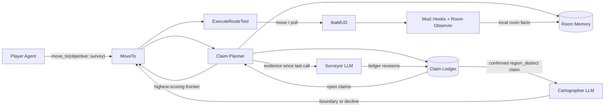
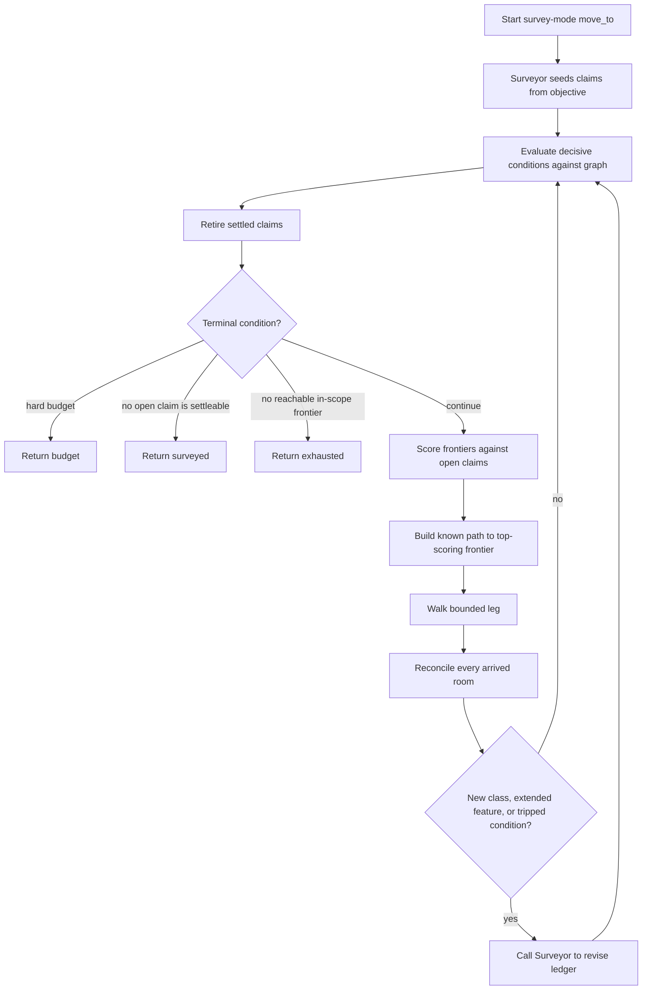
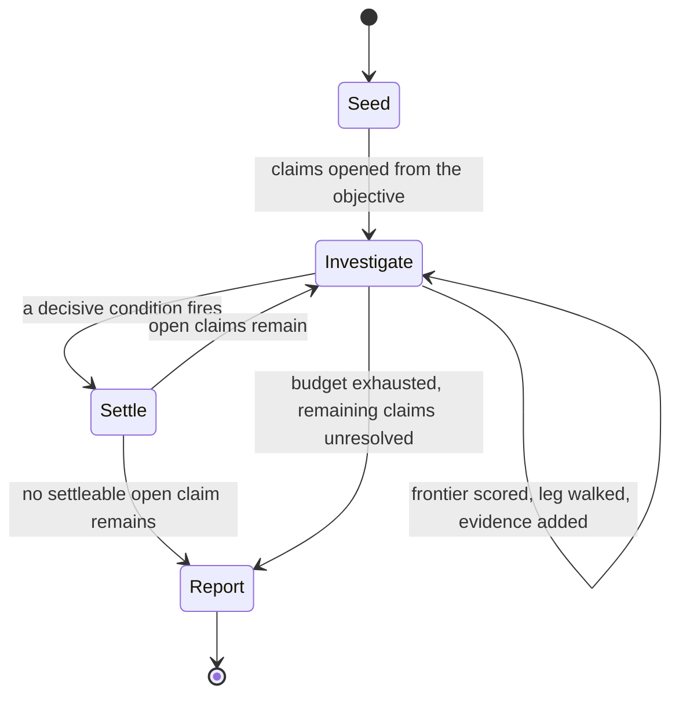
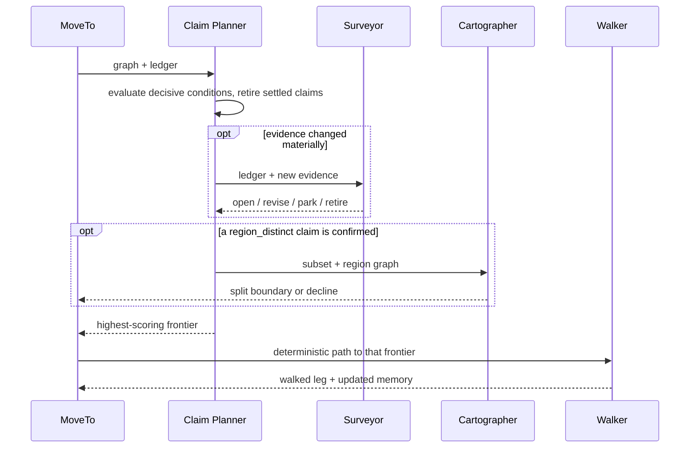

## Proposed Surveyor Architecture

> **Revised.** This document previously described a Surveyor that selected one
> frontier per leg and judged completion by feel against a `min_rooms` floor.
> That design has been superseded by claim-driven surveying, described in
> [claims.md](claims.md) and walked through in
> [session_story.md](session_story.md). The most consequential difference is
> that the Surveyor no longer selects frontiers at all. The earlier
> frontier-selection contract is retained at the end of this document under
> "Superseded design" so the comparison remains available.

The Surveyor is one LLM role inside survey-mode `move_to`. It owns a ledger of
falsifiable claims about the region and nothing else: on each invocation it
reads the evidence gathered since it last ran and decides which claims to open,
revise, park, or retire. Because every claim carries a predicate drawn from a
closed vocabulary, and because each predicate defines a deterministic frontier
scoring function, the movement decision that follows is arithmetic over the
ledger rather than a second judgement call.

The Surveyor does not extract individual rooms, calculate routes, select
frontiers, execute movement, or mutate region boundaries.

### Architecture at a glance



The Claim Planner sits where the Coverage Planner sat, but it computes a
different thing. Instead of coverage metrics it evaluates each open claim's
decisive condition against the room graph, retires the claims that have been
settled, and scores every reachable frontier as the priority-weighted sum of
what the remaining open claims would learn from it.

### Responsibility boundaries

| Component | Responsibility | Uses an LLM? |
|---|---|---:|
| Player Agent | States the survey objective in natural language | Yes |
| `MoveTo` | Owns the loop, budgets, walking, and terminal status | No |
| Claim Planner | Evaluates decisive conditions and scores frontiers against open claims | No |
| Surveyor | Opens, revises, parks, and retires claims from accumulated evidence | Yes |
| Room Observer | Classifies what is visible in the current room | Existing call |
| Cartographer | Places an exact boundary once a `region_distinct` claim is confirmed | Yes |
| `ExecuteRouteTool` | Walks the selected route and polls for interruptions | No |
| `Mud::Hooks` | Reconciles movement and updates room memory | No |

The Room Observer answers, "What is in this room?" The Surveyor answers, "Given
the evidence so far, what should this survey be trying to establish?" The Claim
Planner answers, "Which frontier best serves what we are trying to establish?"
The Cartographer answers, "Where exactly does a distinct region begin?" Keeping
the second and third questions in separate components is what returns movement
selection to deterministic, reproducible code.

### Survey-mode contract

Survey mode is selected through the existing public movement tool, and the
objective is now natural language plus budgets rather than a coverage
specification:

```ruby
move_to(
  objective: {
    type: "survey",
    scope: "Midgaard",
    question: "Walk around town and determine the size of the town and what it offers"
  },
  budget: {
    max_rooms: 30,
    max_legs: 14
  }
)
```

The `coverage` block from the earlier design is gone. Fields such as
`min_rooms`, `min_landmarks`, and `strategy` were attempts to specify from
outside what the survey should accomplish, and claim-driven surveying derives
all three from the objective text instead: minimum coverage becomes the set of
seed claims, landmark targets become `exists` and `count_at_least` claims, and
strategy becomes whichever predicates happen to be open. Budgets remain because
they bound resources rather than describe intent.

### The survey loop



`MoveTo` still replans after every leg, and the walking engine is unchanged.
What differs is that the Surveyor is called conditionally rather than once per
leg. A leg that produces no new room classification, extends no feature chain,
and trips no decisive condition tells the Surveyor nothing it could act on, so
the planner continues on the existing ledger. This bounds reasoner cost the way
`max_decisions` bounds Navigator calls today, and in practice it means dense
interior areas consume very few Surveyor calls.

### What the Surveyor receives

Each call receives the current ledger and the evidence accumulated since the
previous call, rather than a coverage snapshot:

```json
{
  "objective": {
    "question": "Walk around town and determine the size of the town and what it offers",
    "scope": "Midgaard"
  },
  "budget": { "rooms_spent": 14, "rooms_remaining": 16, "legs_remaining": 8 },
  "ledger": [
    {
      "id": "C1",
      "statement": "Midgaard's offerings span a describable set of classes",
      "predicate": "composition",
      "status": "open",
      "confidence": 0.7,
      "classes_observed": ["religious", "lodging", "commercial"],
      "classes_outstanding": ["civic", "residential", "transport"],
      "rooms_spent": 9
    }
  ],
  "new_evidence": [
    {
      "room_id": 7,
      "name": "Market Square",
      "classes": ["commercial", "outdoor"],
      "exits": [
        { "direction": "east", "leads_to": "Main Street" },
        { "direction": "west", "leads_to": "Main Street" }
      ]
    }
  ]
}
```

The `new_evidence` array is what makes the conditional call cadence work,
because the Surveyor never needs the full chronological transcript and only
needs to reason about what changed. Room descriptions belong here only when
they are the evidence a claim turns on.

### What the Surveyor returns

The response is a set of ledger operations, not a movement decision:

```json
{
  "open": [
    {
      "statement": "Main Street is a through-road crossing Midgaard from east to west",
      "predicate": "connects",
      "subject": "feature:main_street",
      "priority": 0.7,
      "confidence": 0.6,
      "decisive_when": "a continuous chain of Main Street rooms reaches the town edge in both directions, or the chain terminates without continuation",
      "room_budget": 10,
      "evidence": [
        { "room_id": 7, "polarity": "support", "note": "opposing exits share the road name" }
      ]
    }
  ],
  "revise": [
    { "id": "C1", "confidence": 0.75, "evidence": [{ "room_id": 7, "polarity": "support", "note": "commercial class observed" }] }
  ],
  "park": [{ "id": "C4", "reason": "competes with extent claims for a limited budget" }],
  "retire": []
}
```

`MoveTo` validates each operation before applying it. A proposed claim whose
predicate is not in the vocabulary is rejected, a claim whose `decisive_when`
cannot be expressed against the room graph is rejected, and a claim matching an
existing predicate and subject is merged rather than duplicated. Because the
Surveyor cannot name a frontier, the class of failure where a reasoner returns
an invalid or stale direction no longer exists, and the deterministic fallback
that the earlier design needed for that case is unnecessary.

### Strategy and completion are consequences, not decisions

Neither strategy nor completion is chosen by anyone under this model. Strategy
is whichever scoring functions the open claims contribute, so a ledger holding
an open `circuit_closes` claim produces perimeter following and a ledger holding
an open `composition` claim produces spread sampling, and the behaviour changes
by itself as claims are settled and retired. Completion is the condition that no
open claim has a decisive test reachable within the remaining budget, which is
computable rather than judged.



This answers the question left open in [strategies.md](strategies.md) about
whether the Player Agent should choose a strategy. Nobody chooses one, so the
question dissolves rather than being decided.

### Relationship to the Navigator

The Navigator and the Surveyor occupy the same position in different objective
modes, but they are no longer the same kind of component:

| Objective mode | Semantic question | Reasoner | Selects the frontier? |
|---|---|---|---|
| Destination | Which frontier is most likely to lead to the named destination? | Navigator | Yes |
| Survey | What should this survey be trying to establish? | Surveyor | No |

Destination mode stops when the current room matches a destination. Survey mode
stops when the ledger has no settleable open claim. The Navigator is not called
during survey mode, and the Surveyor is not called during destination travel.

Whether the Navigator should eventually be reframed the same way, producing
hypotheses about where a destination lies rather than picking directions, is
worth considering but is out of scope here.

### Relationship to the Cartographer

Scope suspicion stops being a side channel. The `scope_suspect` flag becomes an
ordinary claim carrying the `region_distinct` predicate, which means it
accumulates evidence over several legs, competes for frontier attention on
priority like anything else, and can be refuted rather than only ever
escalating. The Cartographer runs when such a claim reaches `confirmed`, and it
still performs exactly the operation it performs today: choosing the room at
which the new place began, so that `RegionTools.split_region` can place the
boundary on that room's stored first-arrival edge.



Keeping boundary placement behind a confirmed claim preserves the property the
earlier design was protecting, namely that a frontier-selection decision cannot
directly mutate persistent region structure.

### Terminal statuses

- `surveyed`: no open claim has a decisive test reachable within budget;
- `budget`: a hard room or leg limit was reached with claims still open, which
  are reported as `unresolved`;
- `exhausted`: no reachable in-scope frontier remains while claims are still
  open;
- `region_exhausted`: unexplored frontiers exist but all lie outside scope;
- `interrupted`: walking stopped because of combat, death, or another event;
- `surveyor_failed`: the Surveyor failed on the seeding call, leaving no ledger
  to score against.

Only the seeding failure is fatal, because once a ledger exists the planner can
continue scoring against it without further reasoner calls. This is a
meaningful robustness gain over the earlier design, where a Surveyor failure
mid-survey removed the only component able to choose a frontier.

The final report is the ledger itself: each claim with its verdict, its
supporting and contradicting evidence, and for unresolved claims a statement of
what remains to settle them. Coverage numbers appear as context rather than as
the answer. [session_story.md](session_story.md) shows a worked example of such
a report.

### Persistence

Claims live in region memory rather than in call-local state. The `claims` and
`claim_evidence` tables sketched in [claims.md](claims.md) mean a later survey
of the same region resumes from what the previous survey established, which is
the capability that `docs/architecture/move_to.md` lists as missing under "Not
represented today" and that coverage counters cannot provide.

---

### Superseded design

The original proposal had the Surveyor select a frontier on every leg and claim
completion when the objective felt sufficiently answered:

```json
{
  "action": "explore",
  "frontier_id": "room-12:east",
  "reason": "This frontier may establish whether the wall road continues around the town.",
  "coverage_gap": "wall continuity",
  "scope_suspect": false
}
```

`MoveTo` validated the frontier ID, rejected completion claims when
`min_rooms` had not been met, and fell back to the planner's top-ranked
frontier when the answer was invalid.

Three problems motivated the revision. The reason string carried the actual
strategy but was discarded at the end of the call, so nothing accumulated
across legs and nothing at all survived the call boundary. Completion depended
on a `min_rooms` floor that had no principled value, since neither ten nor
thirty rooms says anything about whether the player's question was answered.
And putting the reasoner in the movement path made survey behaviour
irreproducible and made a mid-survey reasoner failure unrecoverable. The claim
ledger addresses all three, at the cost of requiring room classification and
feature-chain assembly that the system does not yet have.
